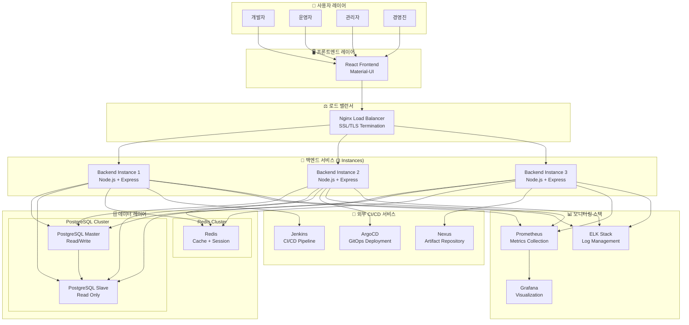
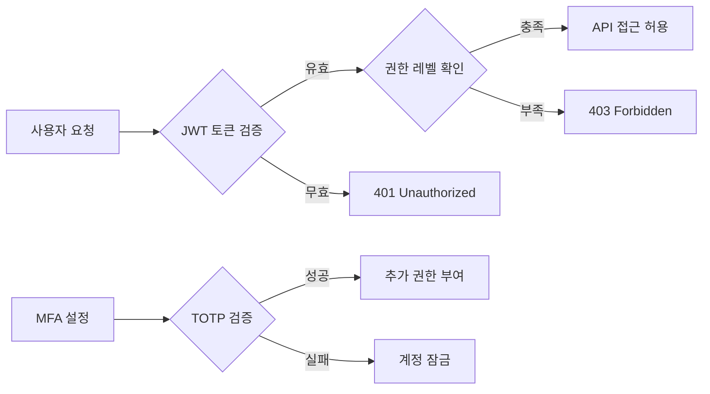
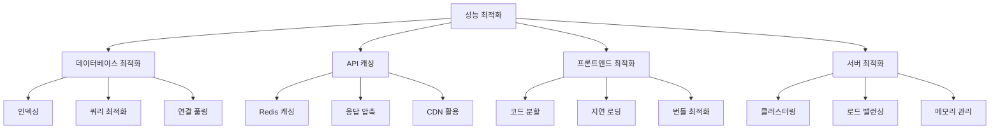
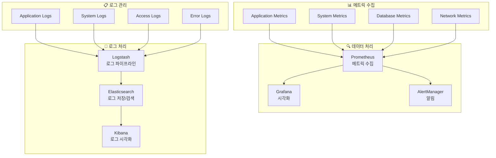
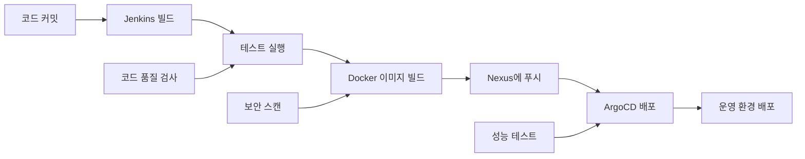
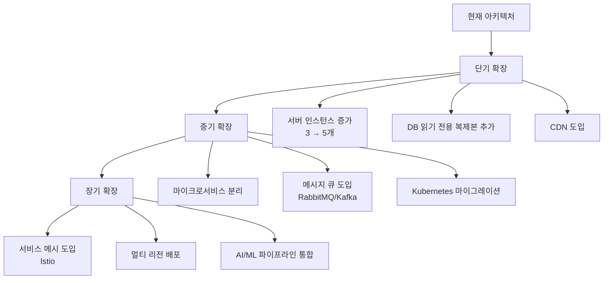

# 🏗️ Timbel CICD Operator - 시스템 아키텍처 문서

## 📋 목차
- [개요](#개요)
- [전체 아키텍처](#전체-아키텍처)
- [시스템 구성 요소](#시스템-구성-요소)
- [데이터베이스 설계](#데이터베이스-설계)
- [API 아키텍처](#api-아키텍처)
- [보안 아키텍처](#보안-아키텍처)
- [성능 및 확장성](#성능-및-확장성)
- [모니터링 및 로깅](#모니터링-및-로깅)
- [배포 아키텍처](#배포-아키텍처)

---

## 🎯 개요

### 시스템 목적
Timbel CICD Operator는 CI/CD 파이프라인 관리, 지식자원 관리, 시스템 모니터링을 위한 **통합 플랫폼**입니다.

### 핵심 가치
- **🔗 통합성**: 모든 개발 및 운영 도구를 하나의 플랫폼에서 관리
- **🚀 자동화**: 지능형 CI/CD 파이프라인 자동화
- **📊 가시성**: 실시간 모니터링 및 메트릭 제공
- **🛡️ 보안성**: 다층 보안 및 권한 관리 시스템
- **📈 확장성**: 마이크로서비스 기반 확장 가능한 아키텍처

### 기술 스택
- **Frontend**: React 18 + TypeScript + Material-UI
- **Backend**: Node.js 18 + Express.js
- **Database**: PostgreSQL 15 (Master-Slave)
- **Cache**: Redis 7 (Cluster)
- **Container**: Docker + Docker Compose
- **CI/CD**: Jenkins + ArgoCD + Nexus
- **Monitoring**: Prometheus + Grafana + ELK Stack
- **Load Balancer**: Nginx

---

## 🏗️ 전체 아키텍처



---

## 🔧 시스템 구성 요소

### 1. 프론트엔드 서비스
```typescript
// 주요 기능 모듈
├── 🏠 홈 대시보드
├── 📚 지식자원 관리
│   ├── 📋 프로젝트 관리
│   ├── 🏢 시스템 도메인 관리
│   ├── 💻 코드 컴포넌트 관리
│   ├── 🎨 디자인 자산 관리
│   └── 📄 문서 관리
├── 🚀 운영센터
│   ├── 🔄 통합 파이프라인 대시보드
│   ├── 📦 저장소 배포
│   ├── ☁️ 클러스터 관리
│   └── 📊 종합 모니터링
└── ⚙️ 시스템 관리
    ├── 👥 사용자 관리
    ├── 🔐 권한 관리
    ├── 📊 시스템 모니터링
    └── 📋 로그 관리
```

### 2. 백엔드 API 서비스
```javascript
// API 모듈 구조
├── 🔐 인증 & 권한 API
│   ├── JWT 토큰 기반 인증
│   ├── MFA (다단계 인증)
│   ├── 세션 관리
│   └── 고급 권한 시스템 (7단계)
├── 📚 지식자원 API
│   ├── CRUD 작업
│   ├── 검색 & 필터링
│   ├── 파일 업로드/다운로드
│   └── 통계 & 대시보드
├── 🚀 CI/CD 파이프라인 API
│   ├── Jenkins 통합
│   ├── ArgoCD 통합
│   ├── Nexus 통합
│   └── 파이프라인 오케스트레이터
├── 🏢 운영센터 API
│   ├── 클러스터 관리
│   ├── 배포 관리
│   ├── 인프라 관리
│   └── 리소스 계산기
└── 📊 모니터링 API
    ├── 시스템 메트릭
    ├── 성능 모니터링
    ├── 로그 관리
    └── 알림 시스템
```

### 3. 데이터베이스 설계
```sql
-- 주요 데이터베이스 스키마
┌─ timbel_knowledge (지식자원 DB)
│  ├── timbel_users (사용자)
│  ├── projects (프로젝트)
│  ├── system_domains (시스템 도메인)
│  ├── code_components (코드 컴포넌트)
│  ├── design_assets (디자인 자산)
│  └── documents (문서)
│
└─ timbel_cicd_operator (운영 DB)
   ├── kubernetes_clusters (클러스터)
   ├── pipeline_executions (파이프라인 실행)
   ├── jenkins_jobs (Jenkins 작업)
   ├── operations_deployments (배포)
   ├── operations_infrastructures (인프라)
   └── system_metrics (시스템 메트릭)
```

---

## 🌐 API 아키텍처

### RESTful API 설계 원칙
```http
# 표준 REST API 패턴
GET    /api/{resource}           # 목록 조회
GET    /api/{resource}/{id}      # 단일 조회
POST   /api/{resource}           # 생성
PUT    /api/{resource}/{id}      # 전체 수정
PATCH  /api/{resource}/{id}      # 부분 수정
DELETE /api/{resource}/{id}      # 삭제

# 특수 작업 (RPC 스타일)
POST   /api/{resource}/{id}/action  # 특정 작업 실행
```

### API 응답 표준화
```json
{
  "success": true,
  "data": {},
  "message": "작업이 성공적으로 완료되었습니다.",
  "timestamp": "2024-01-01T00:00:00.000Z",
  "pagination": {
    "total": 100,
    "limit": 20,
    "offset": 0,
    "hasMore": true
  }
}
```

### 에러 응답 표준화
```json
{
  "success": false,
  "error": "VALIDATION_ERROR",
  "message": "입력 데이터가 올바르지 않습니다.",
  "details": {
    "field": "email",
    "code": "INVALID_FORMAT"
  },
  "timestamp": "2024-01-01T00:00:00.000Z"
}
```

---

## 🛡️ 보안 아키텍처

### 1. 인증 & 권한 시스템


### 2. 권한 레벨 체계
```javascript
// 권한 레벨 (0-6, 낮을수록 높은 권한)
const PERMISSION_LEVELS = {
  ADMIN: 0,        // 시스템 관리자
  EXECUTIVE: 1,    // 경영진
  PO: 2,          // 프로젝트 오너
  PE: 3,          // 프로젝트 엔지니어
  QA: 4,          // 품질 관리
  OPERATIONS: 5,   // 운영팀
  DEVELOPMENT: 6   // 개발팀
};

// 세부 권한 (22개 권한)
const PERMISSIONS = [
  'user_management', 'system_config', 'audit_logs',
  'project_create', 'project_manage', 'project_delete',
  'code_create', 'code_manage', 'code_delete',
  'design_create', 'design_manage', 'design_delete',
  'document_create', 'document_manage', 'document_delete',
  'pipeline_create', 'pipeline_execute', 'pipeline_manage',
  'cluster_manage', 'deployment_manage', 'monitoring_access',
  'approval_manage'
];
```

### 3. 보안 미들웨어 스택
```javascript
// 보안 레이어 구성
app.use(helmet());              // 보안 헤더
app.use(cors(corsOptions));     // CORS 설정
app.use(rateLimiter);          // Rate Limiting
app.use(requestLogger);        // 요청 로깅
app.use(validateInput);        // 입력 검증 (XSS, SQLi 방지)
app.use(jwtAuth.verifyToken);  // JWT 검증
app.use(advancedPermissions);  // 고급 권한 검사
```

---

## 📈 성능 및 확장성

### 1. 성능 최적화 전략


### 2. 확장성 설계
```yaml
# 수평 확장 구성
services:
  # 백엔드 3개 인스턴스
  backend-1: { ... }
  backend-2: { ... }
  backend-3: { ... }
  
  # 데이터베이스 Master-Slave
  postgres-master: { ... }
  postgres-slave: { ... }
  
  # Redis 클러스터
  redis-cluster: { ... }
  
  # 로드 밸런서
  nginx-lb: { ... }
```

### 3. 성능 메트릭
```javascript
// 성능 지표 모니터링
const performanceMetrics = {
  // API 응답 시간
  averageResponseTime: '< 200ms',
  slowQueryThreshold: '< 5s',
  
  // 처리량
  requestsPerSecond: '1000+ RPS',
  concurrentUsers: '500+ users',
  
  // 리소스 사용량
  cpuUsage: '< 70%',
  memoryUsage: '< 80%',
  diskUsage: '< 85%',
  
  // 가용성
  uptime: '99.9%',
  errorRate: '< 0.1%'
};
```

---

## 📊 모니터링 및 로깅

### 1. 모니터링 스택


### 2. 핵심 모니터링 지표
```javascript
// 시스템 모니터링
const systemMetrics = {
  // 서버 리소스
  cpu: 'CPU 사용률, 로드 평균',
  memory: '메모리 사용률, 스왑 사용률',
  disk: '디스크 사용률, I/O 성능',
  network: '네트워크 트래픽, 연결 수',
  
  // 애플리케이션 성능
  api: 'API 응답 시간, 에러율, 처리량',
  database: 'DB 연결 수, 쿼리 성능, 락 대기',
  cache: 'Redis 메모리 사용률, 히트율',
  
  // 비즈니스 메트릭
  users: '활성 사용자 수, 로그인 성공률',
  pipelines: '파이프라인 실행 수, 성공률',
  deployments: '배포 횟수, 성공률'
};
```

### 3. 로그 레벨 및 구조화
```javascript
// 구조화된 로그 형식
const logFormat = {
  timestamp: '2024-01-01T00:00:00.000Z',
  level: 'INFO',
  service: 'backend',
  module: 'auth',
  message: '사용자 로그인 성공',
  metadata: {
    userId: 'user-123',
    ip: '192.168.1.100',
    userAgent: 'Mozilla/5.0...',
    duration: '150ms'
  },
  traceId: 'trace-abc123',
  spanId: 'span-def456'
};
```

---

## 🚀 배포 아키텍처

### 1. 컨테이너 오케스트레이션
```yaml
# Docker Compose 기반 배포
version: '3.8'
services:
  nginx-lb:
    image: nginx:alpine
    ports: ["80:80", "443:443"]
    
  backend:
    build: ./backend
    deploy:
      replicas: 3
      resources:
        limits: { memory: 2G, cpus: '1.0' }
        
  postgres:
    image: postgres:15-alpine
    environment:
      POSTGRES_REPLICATION_MODE: master
      
  redis:
    image: redis:7-alpine
    command: redis-server --cluster-enabled yes
```

### 2. CI/CD 파이프라인


### 3. 환경별 배포 전략
```javascript
// 환경별 설정
const environments = {
  development: {
    replicas: 1,
    resources: { memory: '512M', cpu: '0.5' },
    database: 'single-instance',
    monitoring: 'basic'
  },
  staging: {
    replicas: 2,
    resources: { memory: '1G', cpu: '1.0' },
    database: 'master-slave',
    monitoring: 'full'
  },
  production: {
    replicas: 3,
    resources: { memory: '2G', cpu: '1.0' },
    database: 'cluster',
    monitoring: 'full + alerting'
  }
};
```

---

## 🔧 기술적 의사결정

### 1. 아키텍처 선택 이유
| 기술 | 선택 이유 | 대안 |
|------|-----------|------|
| **Node.js** | JavaScript 생태계 통일, 높은 동시성 처리 | Python Flask, Java Spring |
| **PostgreSQL** | ACID 특성, JSON 지원, 확장성 | MySQL, MongoDB |
| **Redis** | 고성능 캐싱, 다양한 데이터 구조 지원 | Memcached, Hazelcast |
| **React** | 컴포넌트 기반, 풍부한 생태계 | Vue.js, Angular |
| **Docker** | 환경 일관성, 배포 단순화 | VM, Bare Metal |

### 2. 성능 벤치마크
```javascript
// 예상 성능 지표
const performanceBenchmarks = {
  api: {
    responseTime: '50-200ms',
    throughput: '1000+ RPS',
    concurrency: '500+ users'
  },
  database: {
    connectionPool: '20 connections',
    queryTime: '< 100ms (avg)',
    indexHitRatio: '> 95%'
  },
  frontend: {
    initialLoad: '< 3s',
    routeChange: '< 500ms',
    bundleSize: '< 2MB'
  }
};
```

### 3. 확장 계획


---

## 📋 결론

### 핵심 강점
1. **🔗 통합성**: 모든 개발/운영 도구의 단일 플랫폼 통합
2. **🚀 확장성**: 마이크로서비스 기반의 수평 확장 가능
3. **🛡️ 보안성**: 다층 보안 및 세밀한 권한 관리
4. **📊 관찰성**: 포괄적인 모니터링 및 로깅 시스템
5. **⚡ 성능**: 최적화된 캐싱 및 데이터베이스 설계

### 향후 발전 방향
- **AI/ML 통합**: 지능형 파이프라인 최적화
- **클라우드 네이티브**: Kubernetes 기반 컨테이너 오케스트레이션
- **서비스 메시**: Istio를 활용한 마이크로서비스 통신 관리
- **멀티 클라우드**: AWS, GCP, Azure 등 다중 클라우드 지원

---

**📅 문서 버전**: v1.0  
**📅 최종 수정일**: 2024-01-01  
**👤 작성자**: Timbel Platform Team  
**📧 문의**: support@timbel.net
