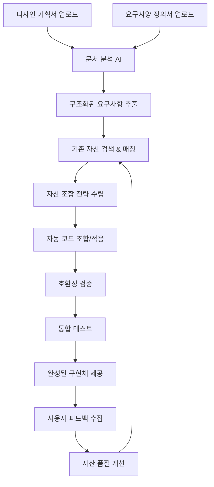

# 📋 문서 기반 지능형 자산 활용 시스템 v1.0
## 디자인 기획서 & 요구사양서 → AI 분석 → 기존 코드 자산 자동 활용

---

## 📋 목차
1. [시스템 개요](#1-시스템-개요)
2. [문서 분석 AI 엔진](#2-문서-분석-ai-엔진)
3. [자산 매칭 시스템](#3-자산-매칭-시스템)
4. [자동 조합 및 적응](#4-자동-조합-및-적응)
5. [통합 워크플로우](#5-통합-워크플로우)
6. [성과 측정](#6-성과-측정)

---

## 1. 시스템 개요

### 1.1 핵심 가치 제안
**"문서만 있으면 AI가 기존 자산을 활용해서 90% 완성된 코드를 제공"**

- **문서 → 코드 직통**: 기획서/요구사양서에서 바로 구현 가능한 코드로
- **기존 자산 최대 활용**: 60% 재사용률로 개발 시간 90% 단축  
- **지능형 조합**: 여러 자산을 자동으로 조합하여 새로운 솔루션 생성
- **적응형 생성**: 기존 코드를 현재 요구사항에 맞게 자동 수정

### 1.2 전체 프로세스 흐름



### 1.3 시스템 아키텍처

```typescript
// [advice from AI] 문서 기반 자산 활용 시스템의 전체 아키텍처
interface DocumentBasedAssetSystem {
  documentAnalyzer: DocumentAnalysisEngine;    // 문서 분석 엔진
  requirementExtractor: RequirementExtractor;  // 요구사항 추출기
  assetMatcher: AssetMatchingEngine;           // 자산 매칭 엔진
  codeComposer: CodeCompositionEngine;         // 코드 조합 엔진
  adaptationEngine: CodeAdaptationEngine;      // 코드 적응 엔진
  integrationValidator: IntegrationValidator;  // 통합 검증기
  performanceTracker: DocumentROITracker;      // 문서 기반 ROI 추적
}
```

---

## 2. 문서 분석 AI 엔진

### 2.1 다중 문서 형식 지원

#### **지원 문서 유형**
```typescript
// [advice from AI] 다양한 문서 형식을 통합 분석하는 시스템
interface DocumentTypes {
  // 기획 문서
  designSpec: {
    formats: ['pdf', 'docx', 'md', 'figma', 'sketch'];
    extractors: ['text', 'image', 'wireframe', 'flowchart'];
  };
  
  // 요구사양서
  requirementSpec: {
    formats: ['pdf', 'docx', 'md', 'excel', 'jira', 'confluence'];
    extractors: ['functional', 'non-functional', 'business-rules', 'constraints'];
  };
  
  // API 명세서
  apiSpec: {
    formats: ['openapi', 'swagger', 'postman', 'insomnia'];
    extractors: ['endpoints', 'schemas', 'auth', 'examples'];
  };
  
  // 데이터베이스 스키마
  dbSchema: {
    formats: ['sql', 'prisma', 'sequelize', 'mongoose'];
    extractors: ['tables', 'relationships', 'constraints', 'indexes'];
  };
}

interface DocumentAnalysisEngine {
  // 통합 문서 분석
  analyzeDocuments(documents: UploadedDocument[]): Promise<{
    unifiedRequirements: UnifiedRequirements;
    confidence: number; // 분석 신뢰도
    ambiguities: AmbiguityItem[]; // 모호한 부분
    suggestions: ClarificationSuggestion[]; // 명확화 제안
  }>;
  
  // 문서 간 일관성 검증
  validateConsistency(documents: UploadedDocument[]): Promise<{
    consistencyScore: number; // 0-1
    conflicts: DocumentConflict[];
    resolutions: ConflictResolution[];
  }>;
}
```

### 2.2 구조화된 요구사항 추출

#### **요구사항 분류 체계**
```typescript
// [advice from AI] 문서에서 추출한 요구사항을 체계적으로 분류
interface UnifiedRequirements {
  // 기능적 요구사항
  functional: {
    userStories: UserStory[];
    features: FeatureRequirement[];
    workflows: WorkflowRequirement[];
    businessRules: BusinessRule[];
  };
  
  // 비기능적 요구사항
  nonFunctional: {
    performance: PerformanceRequirement[];
    security: SecurityRequirement[];
    usability: UsabilityRequirement[];
    scalability: ScalabilityRequirement[];
  };
  
  // 기술적 요구사항
  technical: {
    architecture: ArchitectureRequirement[];
    integration: IntegrationRequirement[];
    deployment: DeploymentRequirement[];
    monitoring: MonitoringRequirement[];
  };
  
  // UI/UX 요구사항
  uiux: {
    wireframes: WireframeSpec[];
    designSystem: DesignSystemSpec;
    userFlows: UserFlowSpec[];
    accessibility: AccessibilitySpec[];
  };
}

interface UserStory {
  id: string;
  title: string;
  description: string;
  acceptanceCriteria: AcceptanceCriteria[];
  priority: 'critical' | 'high' | 'medium' | 'low';
  estimatedEffort: number; // story points
  dependencies: string[]; // 의존성 있는 다른 스토리 ID
  
  // AI 분석 결과
  complexity: 'simple' | 'moderate' | 'complex';
  reuseOpportunity: number; // 0-1, 기존 자산 재사용 가능성
  suggestedAssets: string[]; // 추천 기존 자산 ID
}

interface FeatureRequirement {
  name: string;
  category: 'authentication' | 'data-management' | 'ui-component' | 'integration' | 'business-logic';
  specifications: FeatureSpec[];
  constraints: Constraint[];
  
  // 자산 매칭을 위한 메타데이터
  keywords: string[];
  technicalTags: string[];
  functionalTags: string[];
}
```

#### **자연어 처리 및 의미 분석**
```typescript
// [advice from AI] 고도화된 자연어 처리로 문서의 의미를 정확히 파악
interface NaturalLanguageProcessor {
  // 의도 분석
  analyzeIntent(text: string): Promise<{
    primaryIntent: IntentType;
    secondaryIntents: IntentType[];
    confidence: number;
    entities: ExtractedEntity[];
  }>;
  
  // 기술 용어 추출
  extractTechnicalTerms(text: string): Promise<{
    technologies: TechnologyTerm[];
    frameworks: FrameworkTerm[];
    patterns: PatternTerm[];
    domains: DomainTerm[];
  }>;
  
  // 요구사항 우선순위 자동 판단
  prioritizeRequirements(requirements: string[]): Promise<{
    prioritized: PrioritizedRequirement[];
    reasoning: PriorityReasoning[];
  }>;
  
  // 모호한 표현 감지
  detectAmbiguity(text: string): Promise<{
    ambiguousTerms: AmbiguousTerm[];
    clarificationQuestions: string[];
    suggestedDefinitions: TermDefinition[];
  }>;
}

enum IntentType {
  CREATE_FEATURE = 'create_feature',
  MODIFY_EXISTING = 'modify_existing',
  INTEGRATE_SYSTEM = 'integrate_system',
  IMPROVE_PERFORMANCE = 'improve_performance',
  ENHANCE_SECURITY = 'enhance_security',
  DESIGN_UI = 'design_ui'
}

interface TechnologyTerm {
  term: string;
  category: 'language' | 'framework' | 'database' | 'tool' | 'service';
  confidence: number;
  context: string; // 사용된 문맥
  suggestedAssets: string[]; // 관련 자산 ID
}
```

### 2.3 시각적 요소 분석

#### **디자인 문서 분석**
```typescript
// [advice from AI] 이미지, 와이어프레임, 플로우차트 등 시각적 요소 분석
interface VisualAnalysisEngine {
  // 와이어프레임 분석
  analyzeWireframes(images: ImageFile[]): Promise<{
    uiComponents: DetectedUIComponent[];
    layouts: LayoutStructure[];
    userFlows: DetectedUserFlow[];
    designPatterns: DetectedDesignPattern[];
  }>;
  
  // 플로우차트 분석
  analyzeFlowcharts(images: ImageFile[]): Promise<{
    processes: ProcessFlow[];
    decisions: DecisionPoint[];
    dataFlows: DataFlow[];
    systemBoundaries: SystemBoundary[];
  }>;
  
  // 스크린 목업 분석
  analyzeMockups(images: ImageFile[]): Promise<{
    screens: ScreenSpec[];
    interactions: InteractionSpec[];
    components: ComponentSpec[];
    styleGuide: ExtractedStyleGuide;
  }>;
}

interface DetectedUIComponent {
  type: 'button' | 'input' | 'table' | 'modal' | 'form' | 'navigation' | 'card';
  properties: ComponentProperty[];
  position: BoundingBox;
  suggestedAssets: string[]; // 매칭되는 기존 컴포넌트
  
  // 자동 생성된 요구사항
  requirements: GeneratedRequirement[];
}

interface ComponentProperty {
  name: string;
  value: string;
  type: 'style' | 'behavior' | 'data' | 'validation';
  confidence: number;
}

interface GeneratedRequirement {
  type: 'functional' | 'visual' | 'behavioral';
  description: string;
  priority: number;
  implementationHint: string;
}
```

---

## 3. 자산 매칭 시스템

### 3.1 다차원 매칭 알고리즘

#### **지능형 자산 검색**
```typescript
// [advice from AI] 요구사항과 기존 자산을 다차원적으로 매칭
interface AssetMatchingEngine {
  // 통합 매칭 시스템
  findMatchingAssets(requirements: UnifiedRequirements): Promise<{
    exactMatches: AssetMatch[];      // 정확히 일치하는 자산
    partialMatches: AssetMatch[];    // 부분적으로 일치하는 자산
    composableMatches: AssetMatch[]; // 조합 가능한 자산들
    adaptableMatches: AssetMatch[];  // 수정 가능한 자산들
    
    // 매칭 전략
    recommendedStrategy: MatchingStrategy;
    alternativeStrategies: MatchingStrategy[];
  }>;
  
  // 의미 기반 매칭
  semanticMatching(requirement: FeatureRequirement): Promise<{
    assets: SemanticMatch[];
    similarity: number; // 0-1
    reasoning: MatchingReasoning[];
  }>;
  
  // 기능 기반 매칭
  functionalMatching(userStory: UserStory): Promise<{
    assets: FunctionalMatch[];
    coverage: number; // 요구사항 커버리지 %
    gaps: RequirementGap[]; // 부족한 부분
  }>;
  
  // 기술 스택 매칭
  technicalMatching(techRequirements: TechnicalRequirement[]): Promise<{
    compatibleAssets: TechnicalMatch[];
    incompatibleAssets: IncompatibleAsset[];
    migrationOptions: MigrationOption[];
  }>;
}

interface AssetMatch {
  asset: CodeResource;
  matchType: 'exact' | 'partial' | 'composable' | 'adaptable';
  matchScore: number; // 0-1
  
  // 매칭 세부사항
  functionalMatch: number; // 기능적 일치도
  technicalMatch: number;  // 기술적 일치도
  qualityMatch: number;    // 품질 일치도
  
  // 활용 방안
  usageStrategy: UsageStrategy;
  adaptationRequired: AdaptationRequirement[];
  integrationComplexity: 'low' | 'medium' | 'high';
  
  // 예상 성과
  estimatedTimeSaving: number; // 분
  estimatedCostSaving: number; // 원
  riskAssessment: RiskAssessment;
}

interface UsageStrategy {
  approach: 'direct_use' | 'adaptation' | 'composition' | 'template';
  steps: ImplementationStep[];
  dependencies: string[];
  prerequisites: string[];
}
```

#### **컨텍스트 인식 매칭**
```typescript
// [advice from AI] 프로젝트 컨텍스트를 고려한 지능형 매칭
interface ContextAwareMatching {
  // 프로젝트 컨텍스트 분석
  analyzeProjectContext(requirements: UnifiedRequirements): Promise<{
    domain: BusinessDomain;
    scale: ProjectScale;
    complexity: ProjectComplexity;
    constraints: ProjectConstraint[];
    preferences: TechnicalPreference[];
  }>;
  
  // 컨텍스트 기반 필터링
  filterAssetsByContext(
    assets: AssetMatch[],
    context: ProjectContext
  ): Promise<{
    suitable: AssetMatch[];
    marginal: AssetMatch[];
    unsuitable: AssetMatch[];
    reasoning: FilteringReasoning[];
  }>;
  
  // 조직 선호도 반영
  applyOrganizationalPreferences(
    matches: AssetMatch[],
    orgPrefs: OrganizationalPreferences
  ): Promise<{
    prioritized: AssetMatch[];
    adjustmentReasons: string[];
  }>;
}

interface ProjectContext {
  // 비즈니스 컨텍스트
  industry: string;
  businessModel: string;
  targetAudience: string;
  complianceRequirements: string[];
  
  // 기술적 컨텍스트
  existingTechStack: TechnologyStack;
  architecturalPatterns: string[];
  performanceRequirements: PerformanceSpec;
  scalabilityNeeds: ScalabilitySpec;
  
  // 조직적 컨텍스트
  teamSize: number;
  skillLevel: 'junior' | 'mixed' | 'senior';
  timeline: ProjectTimeline;
  budget: BudgetConstraint;
}

interface OrganizationalPreferences {
  preferredTechnologies: string[];
  avoidedTechnologies: string[];
  qualityStandards: QualityStandard[];
  securityPolicies: SecurityPolicy[];
  maintenancePreferences: MaintenancePreference[];
}
```

### 3.2 자산 조합 최적화

#### **최적 조합 전략**
```typescript
// [advice from AI] 여러 자산을 최적으로 조합하는 전략 엔진
interface AssetCompositionOptimizer {
  // 최적 조합 찾기
  findOptimalComposition(
    requirements: UnifiedRequirements,
    availableAssets: AssetMatch[]
  ): Promise<{
    recommendedComposition: AssetComposition;
    alternativeCompositions: AssetComposition[];
    tradeoffAnalysis: TradeoffAnalysis;
  }>;
  
  // 조합 호환성 검증
  validateCompositionCompatibility(
    composition: AssetComposition
  ): Promise<{
    compatible: boolean;
    conflicts: CompatibilityConflict[];
    resolutions: ConflictResolution[];
    integrationComplexity: number; // 0-1
  }>;
  
  // 조합 성능 예측
  predictCompositionPerformance(
    composition: AssetComposition
  ): Promise<{
    expectedPerformance: PerformancePrediction;
    bottlenecks: PerformanceBottleneck[];
    optimizationSuggestions: OptimizationSuggestion[];
  }>;
}

interface AssetComposition {
  id: string;
  name: string;
  description: string;
  
  // 구성 자산들
  coreAssets: CompositionAsset[];      // 핵심 자산
  supportingAssets: CompositionAsset[]; // 지원 자산
  glueCode: GlueCodeSpec[];            // 연결 코드
  
  // 조합 메타데이터
  coverageScore: number; // 요구사항 커버리지 %
  qualityScore: number;  // 전체 품질 점수
  maintainabilityScore: number; // 유지보수성 점수
  
  // 구현 정보
  implementationPlan: ImplementationPlan;
  estimatedEffort: EffortEstimate;
  riskAssessment: CompositionRiskAssessment;
}

interface CompositionAsset {
  asset: CodeResource;
  role: 'primary' | 'secondary' | 'utility' | 'integration';
  adaptations: AdaptationSpec[];
  dependencies: AssetDependency[];
  
  // 통합 정보
  integrationPoints: IntegrationPoint[];
  dataFlow: DataFlowSpec;
  eventFlow: EventFlowSpec;
}

interface GlueCodeSpec {
  purpose: string;
  type: 'adapter' | 'bridge' | 'facade' | 'proxy';
  sourceAsset: string;
  targetAsset: string;
  
  // 생성할 코드
  generatedCode: string;
  testCode: string;
  documentation: string;
}
```

---

## 4. 자동 조합 및 적응

### 4.1 지능형 코드 조합

#### **자동 코드 조합 엔진**
```typescript
// [advice from AI] 선택된 자산들을 자동으로 조합하는 엔진
interface CodeCompositionEngine {
  // 자산 조합 실행
  composeAssets(composition: AssetComposition): Promise<{
    composedCode: ComposedCodebase;
    integrationTests: TestSuite;
    documentation: GeneratedDocumentation;
    deploymentConfig: DeploymentConfiguration;
  }>;
  
  // 의존성 해결
  resolveDependencies(assets: CompositionAsset[]): Promise<{
    resolvedDependencies: ResolvedDependency[];
    conflictResolutions: DependencyResolution[];
    installationScript: string;
  }>;
  
  // 인터페이스 정규화
  normalizeInterfaces(assets: CompositionAsset[]): Promise<{
    unifiedInterfaces: UnifiedInterface[];
    adapterCode: AdapterCode[];
    migrationGuide: InterfaceMigrationGuide;
  }>;
  
  // 설정 통합
  mergeConfigurations(assets: CompositionAsset[]): Promise<{
    mergedConfig: UnifiedConfiguration;
    conflictResolutions: ConfigConflictResolution[];
    environmentSetup: EnvironmentSetup;
  }>;
}

interface ComposedCodebase {
  // 프로젝트 구조
  structure: ProjectStructure;
  files: GeneratedFile[];
  
  // 핵심 구성요소
  components: IntegratedComponent[];
  services: IntegratedService[];
  utilities: IntegratedUtility[];
  
  // 통합 레이어
  integrationLayer: IntegrationLayer;
  apiLayer: APILayer;
  dataLayer: DataLayer;
  
  // 품질 보장
  qualityMetrics: CompositionQualityMetrics;
  testCoverage: TestCoverageReport;
  performanceProfile: PerformanceProfile;
}

interface IntegratedComponent {
  originalAsset: CodeResource;
  adaptedCode: string;
  adaptations: AppliedAdaptation[];
  
  // 통합 정보
  integrationPoints: ActiveIntegrationPoint[];
  dependencies: ResolvedDependency[];
  configurations: ComponentConfiguration;
  
  // 품질 정보
  qualityScore: number;
  testCoverage: number;
  performanceMetrics: ComponentPerformanceMetrics;
}
```

#### **적응형 코드 생성**
```typescript
// [advice from AI] 기존 자산을 현재 요구사항에 맞게 자동 적응
interface CodeAdaptationEngine {
  // 자동 코드 적응
  adaptAsset(
    asset: CodeResource,
    targetRequirements: FeatureRequirement[],
    context: ProjectContext
  ): Promise<{
    adaptedCode: string;
    adaptations: AppliedAdaptation[];
    qualityImpact: QualityImpactAnalysis;
    testUpdates: TestUpdateSpec[];
  }>;
  
  // 인터페이스 적응
  adaptInterface(
    originalInterface: InterfaceSpec,
    targetInterface: InterfaceSpec
  ): Promise<{
    adaptedInterface: InterfaceSpec;
    adapterCode: string;
    migrationGuide: string;
    breakingChanges: BreakingChangeSpec[];
  }>;
  
  // 스타일 적응
  adaptStyling(
    originalCode: string,
    targetStyleGuide: StyleGuide,
    designSystem: DesignSystem
  ): Promise<{
    styledCode: string;
    styleChanges: StyleChange[];
    designTokens: DesignToken[];
    cssVariables: CSSVariable[];
  }>;
  
  // 성능 적응
  adaptForPerformance(
    code: string,
    performanceRequirements: PerformanceRequirement[]
  ): Promise<{
    optimizedCode: string;
    optimizations: PerformanceOptimization[];
    benchmarkResults: BenchmarkResult[];
    monitoringCode: MonitoringCode;
  }>;
}

interface AppliedAdaptation {
  type: 'interface' | 'styling' | 'logic' | 'performance' | 'security';
  description: string;
  originalCode: string;
  adaptedCode: string;
  
  // 적응 메타데이터
  confidence: number; // 적응 품질 신뢰도
  impact: AdaptationImpact;
  reversible: boolean; // 원복 가능 여부
  
  // 검증 정보
  testsPassed: boolean;
  qualityMaintained: boolean;
  performanceImpact: number; // -1 to 1
}

interface AdaptationImpact {
  functionalImpact: 'none' | 'minor' | 'moderate' | 'major';
  performanceImpact: 'improvement' | 'neutral' | 'degradation';
  maintainabilityImpact: 'improvement' | 'neutral' | 'degradation';
  securityImpact: 'improvement' | 'neutral' | 'risk';
}
```

### 4.2 품질 보장 시스템

#### **자동 품질 검증**
```typescript
// [advice from AI] 조합된 코드의 품질을 자동으로 검증하고 보장
interface QualityAssuranceEngine {
  // 통합 품질 검증
  validateComposedCode(composedCode: ComposedCodebase): Promise<{
    overallQuality: QualityAssessment;
    componentQualities: ComponentQualityAssessment[];
    integrationQualities: IntegrationQualityAssessment[];
    recommendations: QualityImprovement[];
  }>;
  
  // 호환성 검증
  validateCompatibility(
    composition: AssetComposition,
    targetEnvironment: TargetEnvironment
  ): Promise<{
    compatibilityScore: number; // 0-1
    issues: CompatibilityIssue[];
    resolutions: CompatibilityResolution[];
    migrationPlan: CompatibilityMigrationPlan;
  }>;
  
  // 성능 검증
  validatePerformance(
    composedCode: ComposedCodebase,
    performanceRequirements: PerformanceRequirement[]
  ): Promise<{
    performanceScore: number; // 0-1
    benchmarks: PerformanceBenchmark[];
    bottlenecks: PerformanceBottleneck[];
    optimizations: PerformanceOptimization[];
  }>;
  
  // 보안 검증
  validateSecurity(
    composedCode: ComposedCodebase,
    securityRequirements: SecurityRequirement[]
  ): Promise<{
    securityScore: number; // 0-1
    vulnerabilities: SecurityVulnerability[];
    mitigations: SecurityMitigation[];
    complianceStatus: ComplianceStatus[];
  }>;
}

interface QualityAssessment {
  overallScore: number; // 0-100
  
  // 세부 점수
  codeQuality: number;        // 코드 품질
  architectureQuality: number; // 아키텍처 품질
  testQuality: number;        // 테스트 품질
  documentationQuality: number; // 문서 품질
  
  // 품질 지표
  maintainabilityIndex: number;
  reliabilityIndex: number;
  performanceIndex: number;
  securityIndex: number;
  
  // 개선 제안
  criticalIssues: QualityIssue[];
  improvements: QualityImprovement[];
  bestPractices: BestPracticeRecommendation[];
}

interface QualityImprovement {
  priority: 'critical' | 'high' | 'medium' | 'low';
  category: 'performance' | 'security' | 'maintainability' | 'reliability';
  description: string;
  
  // 개선 방안
  solution: string;
  automatable: boolean;
  estimatedEffort: number; // 시간 (분)
  expectedImpact: number; // 품질 점수 향상
  
  // 구현 정보
  codeChanges: CodeChange[];
  testChanges: TestChange[];
  documentationChanges: DocumentationChange[];
}
```

---

## 5. 통합 워크플로우

### 5.1 End-to-End 프로세스

#### **완전 자동화 워크플로우**
```typescript
// [advice from AI] 문서 업로드부터 완성된 코드까지 전체 프로세스
interface DocumentToCodeWorkflow {
  // 전체 워크플로우 실행
  executeFullWorkflow(input: WorkflowInput): Promise<{
    result: WorkflowResult;
    timeline: WorkflowTimeline;
    qualityReport: QualityReport;
    costBenefit: CostBenefitAnalysis;
  }>;
  
  // 단계별 실행 (사용자 개입 가능)
  executeStepByStep(input: WorkflowInput): Promise<{
    steps: WorkflowStep[];
    currentStep: number;
    userDecisionPoints: UserDecisionPoint[];
  }>;
  
  // 워크플로우 모니터링
  monitorWorkflow(workflowId: string): Promise<{
    status: WorkflowStatus;
    progress: WorkflowProgress;
    issues: WorkflowIssue[];
    estimatedCompletion: Date;
  }>;
}

interface WorkflowInput {
  // 입력 문서들
  documents: UploadedDocument[];
  
  // 프로젝트 정보
  projectInfo: {
    name: string;
    description: string;
    targetEnvironment: TargetEnvironment;
    constraints: ProjectConstraint[];
  };
  
  // 사용자 선호도
  preferences: {
    automationLevel: 'full' | 'guided' | 'manual';
    qualityThreshold: number; // 0-1
    performanceThreshold: number; // 0-1
    reusePreference: number; // 0-1, 재사용 vs 새로운 구현
  };
  
  // 조직 정책
  organizationPolicies: OrganizationalPolicies;
}

interface WorkflowResult {
  // 최종 산출물
  generatedCodebase: ComposedCodebase;
  documentation: ComprehensiveDocumentation;
  testSuite: ComprehensiveTestSuite;
  deploymentPackage: DeploymentPackage;
  
  // 분석 결과
  requirementsAnalysis: RequirementsAnalysisReport;
  assetUtilization: AssetUtilizationReport;
  qualityAssurance: QualityAssuranceReport;
  performanceAnalysis: PerformanceAnalysisReport;
  
  // 성과 정보
  timeSaved: number; // 분
  costSaved: number; // 원
  reuseRate: number; // %
  qualityScore: number; // 0-100
}
```

#### **사용자 인터랙션 포인트**
```typescript
// [advice from AI] 사용자가 개입할 수 있는 결정 포인트들
interface UserDecisionPoint {
  id: string;
  step: string;
  type: 'confirmation' | 'selection' | 'customization' | 'approval';
  
  // 결정 정보
  title: string;
  description: string;
  options: DecisionOption[];
  recommendation: string;
  
  // 컨텍스트 정보
  impact: DecisionImpact;
  tradeoffs: Tradeoff[];
  alternatives: Alternative[];
  
  // 시간 제한
  timeout?: number; // 초 단위
  defaultAction: DecisionOption; // 타임아웃 시 기본 선택
}

interface DecisionOption {
  id: string;
  label: string;
  description: string;
  
  // 예상 결과
  expectedOutcome: ExpectedOutcome;
  risks: Risk[];
  benefits: Benefit[];
  
  // 메타데이터
  confidence: number; // 0-1
  complexity: 'low' | 'medium' | 'high';
  reversible: boolean;
}

interface DecisionImpact {
  scope: 'local' | 'component' | 'system' | 'global';
  severity: 'minor' | 'moderate' | 'major' | 'critical';
  
  // 영향 영역
  affectedAreas: string[];
  affectedAssets: string[];
  affectedRequirements: string[];
  
  // 예상 변화
  timeImpact: number; // 분 단위 시간 변화
  costImpact: number; // 원 단위 비용 변화
  qualityImpact: number; // -1 to 1, 품질 변화
}
```

### 5.2 실시간 모니터링 및 피드백

#### **워크플로우 모니터링**
```typescript
// [advice from AI] 실시간으로 워크플로우 진행 상황을 모니터링
interface WorkflowMonitoring {
  // 실시간 상태 추적
  trackProgress(workflowId: string): Promise<{
    currentStage: WorkflowStage;
    completedSteps: WorkflowStep[];
    remainingSteps: WorkflowStep[];
    
    // 진행률 정보
    overallProgress: number; // 0-1
    stageProgress: number; // 0-1
    estimatedTimeRemaining: number; // 분
    
    // 성능 지표
    processingSpeed: number; // 단계/분
    resourceUtilization: ResourceUtilization;
    qualityTrend: QualityTrend[];
  }>;
  
  // 이상 상황 감지
  detectAnomalies(workflowId: string): Promise<{
    anomalies: WorkflowAnomaly[];
    severity: 'info' | 'warning' | 'error' | 'critical';
    suggestedActions: SuggestedAction[];
    autoRecoveryAttempts: RecoveryAttempt[];
  }>;
  
  // 사용자 피드백 수집
  collectFeedback(workflowId: string): Promise<{
    satisfactionScore: number; // 1-5
    usefulnessScore: number; // 1-5
    accuracyScore: number; // 1-5
    
    // 정성적 피드백
    positiveAspects: string[];
    improvementAreas: string[];
    suggestions: string[];
    
    // 구체적 평가
    assetRelevance: number; // 1-5
    codeQuality: number; // 1-5
    documentationQuality: number; // 1-5
  }>;
}

interface WorkflowStage {
  name: string;
  description: string;
  status: 'pending' | 'in_progress' | 'completed' | 'failed' | 'skipped';
  
  // 시간 정보
  startTime?: Date;
  endTime?: Date;
  estimatedDuration: number; // 분
  actualDuration?: number; // 분
  
  // 결과 정보
  outputs: StageOutput[];
  metrics: StageMetrics;
  issues: StageIssue[];
}

interface WorkflowAnomaly {
  type: 'performance_degradation' | 'quality_drop' | 'resource_exhaustion' | 'timeout';
  description: string;
  severity: 'low' | 'medium' | 'high' | 'critical';
  
  // 발생 정보
  detectedAt: Date;
  affectedSteps: string[];
  rootCause?: string;
  
  // 해결 방안
  possibleCauses: string[];
  suggestedFixes: string[];
  autoFixAttempted: boolean;
}
```

---

## 6. 성과 측정

### 6.1 문서 기반 개발 ROI

#### **문서 투입 대비 성과 측정**
```typescript
// [advice from AI] 문서를 입력으로 한 개발 프로세스의 ROI 측정
interface DocumentBasedROITracker {
  // 전체 ROI 계산
  calculateDocumentROI(workflowResult: WorkflowResult): Promise<{
    totalROI: number; // %
    timeROI: number; // 시간 절약 기준
    costROI: number; // 비용 절약 기준
    qualityROI: number; // 품질 향상 기준
    
    // 세부 분석
    documentAnalysisROI: DocumentAnalysisROI;
    assetReuseROI: AssetReuseROI;
    codeGenerationROI: CodeGenerationROI;
    qualityAssuranceROI: QualityAssuranceROI;
  }>;
  
  // 문서 품질 대비 결과 품질 분석
  analyzeDocumentToCodeQuality(): Promise<{
    inputQuality: DocumentQualityMetrics;
    outputQuality: CodeQualityMetrics;
    qualityAmplification: number; // 품질 증폭 비율
    
    // 품질 개선 영역
    improvedAspects: QualityImprovement[];
    maintainedAspects: QualityAspect[];
    degradedAspects: QualityDegradation[];
  }>;
  
  // 문서 유형별 효과성 분석
  analyzeDocumentTypeEffectiveness(): Promise<{
    designSpecEffectiveness: EffectivenessMetrics;
    requirementSpecEffectiveness: EffectivenessMetrics;
    apiSpecEffectiveness: EffectivenessMetrics;
    
    // 조합 효과
    synergisticEffects: SynergisticEffect[];
    optimalCombinations: DocumentCombination[];
  }>;
}

interface DocumentAnalysisROI {
  // 분석 투입 비용
  analysisTime: number; // 분
  analysisCost: number; // 원 (AI API 비용 등)
  
  // 분석 결과 가치
  requirementsCoverage: number; // %
  ambiguityReduction: number; // %
  clarificationValue: number; // 원 (명확화로 인한 절약)
  
  // 분석 품질
  accuracyScore: number; // 0-1
  completenessScore: number; // 0-1
  consistencyScore: number; // 0-1
}

interface AssetReuseROI {
  // 재사용 성과
  assetsReused: number;
  reuseRate: number; // %
  totalReuseValue: number; // 원
  
  // 재사용별 세부 성과
  exactReuseValue: number; // 정확히 일치하는 재사용
  adaptedReuseValue: number; // 수정 후 재사용
  composedReuseValue: number; // 조합 재사용
  
  // 재사용 효율성
  searchEfficiency: number; // 검색 정확도
  matchingAccuracy: number; // 매칭 정확도
  adaptationSuccess: number; // 적응 성공률
}
```

### 6.2 조직 차원 성과 분석

#### **조직 전체 개발 생산성 향상**
```typescript
// [advice from AI] 조직 차원에서의 문서 기반 개발 성과 분석
interface OrganizationalImpactAnalyzer {
  // 조직 전체 생산성 분석
  analyzeOrganizationalProductivity(): Promise<{
    overallProductivityGain: number; // %
    teamProductivityGains: TeamProductivityGain[];
    
    // 생산성 요인 분석
    documentQualityImpact: number; // 문서 품질의 생산성 기여도
    assetReuseImpact: number; // 자산 재사용의 생산성 기여도
    automationImpact: number; // 자동화의 생산성 기여도
    
    // 조직 변화
    skillDevelopment: SkillDevelopmentMetrics;
    processImprovement: ProcessImprovementMetrics;
    culturalChange: CulturalChangeMetrics;
  }>;
  
  // 지식 자산 축적 효과
  analyzeKnowledgeAccumulation(): Promise<{
    totalAssetValue: number; // 원
    assetGrowthRate: number; // 월별 성장률
    assetUtilizationRate: number; // %
    
    // 지식 네트워크 효과
    networkEffects: NetworkEffect[];
    knowledgeSharing: KnowledgeSharingMetrics;
    innovationAcceleration: InnovationMetrics;
  }>;
  
  // 장기적 전략 가치
  assessStrategicValue(): Promise<{
    competitiveAdvantage: CompetitiveAdvantageMetrics;
    marketResponseSpeed: number; // 시장 대응 속도 향상
    innovationCapacity: number; // 혁신 역량 향상
    
    // 미래 가치
    predictedFutureValue: FutureValuePrediction;
    strategicOptions: StrategicOption[];
    riskMitigation: RiskMitigationValue;
  }>;
}

interface TeamProductivityGain {
  teamId: string;
  teamName: string;
  
  // 생산성 지표
  velocityIncrease: number; // %
  qualityImprovement: number; // %
  deliverySpeedUp: number; // %
  
  // 팀별 특성
  documentUtilizationRate: number; // 문서 활용률
  assetReuseRate: number; // 자산 재사용률
  automationAdoption: number; // 자동화 도입률
  
  // 팀 만족도
  developerSatisfaction: number; // 1-5
  workLifeBalance: number; // 1-5
  learningOpportunity: number; // 1-5
}

interface NetworkEffect {
  type: 'knowledge_sharing' | 'cross_pollination' | 'collective_intelligence';
  description: string;
  measuredImpact: number; // 정량적 영향
  
  // 네트워크 메트릭
  connectionStrength: number; // 연결 강도
  informationFlow: number; // 정보 흐름 속도
  collaborationIncrease: number; // 협업 증가율
}
```

### 6.3 지속적 개선 시스템

#### **피드백 기반 시스템 개선**
```typescript
// [advice from AI] 사용자 피드백을 바탕으로 시스템을 지속적으로 개선
interface ContinuousImprovementEngine {
  // 성과 데이터 분석
  analyzePerformanceData(): Promise<{
    trends: PerformanceTrend[];
    patterns: PerformancePattern[];
    anomalies: PerformanceAnomaly[];
    
    // 개선 기회 식별
    improvementOpportunities: ImprovementOpportunity[];
    optimizationPotential: OptimizationPotential[];
  }>;
  
  // 사용자 피드백 분석
  analyzeFeedback(): Promise<{
    satisfactionTrends: SatisfactionTrend[];
    commonComplaints: ComplaintAnalysis[];
    featureRequests: FeatureRequest[];
    
    // 개선 우선순위
    prioritizedImprovements: PrioritizedImprovement[];
    quickWins: QuickWin[];
    strategicInitiatives: StrategicInitiative[];
  }>;
  
  // 자동 시스템 최적화
  optimizeSystem(): Promise<{
    appliedOptimizations: AppliedOptimization[];
    performanceImprovements: PerformanceImprovement[];
    userExperienceEnhancements: UXEnhancement[];
    
    // 최적화 결과
    beforeAfterComparison: BeforeAfterComparison;
    userImpactAssessment: UserImpactAssessment;
    rollbackPlan: RollbackPlan;
  }>;
}

interface ImprovementOpportunity {
  area: 'document_analysis' | 'asset_matching' | 'code_generation' | 'quality_assurance';
  description: string;
  currentPerformance: number;
  targetPerformance: number;
  
  // 개선 계획
  improvementPlan: ImprovementPlan;
  estimatedImpact: EstimatedImpact;
  implementationEffort: ImplementationEffort;
  
  // 우선순위
  priority: number; // 1-10
  urgency: 'low' | 'medium' | 'high' | 'critical';
  strategicValue: number; // 1-10
}

interface AppliedOptimization {
  type: 'algorithm_improvement' | 'performance_tuning' | 'ui_enhancement' | 'workflow_streamlining';
  description: string;
  
  // 최적화 결과
  performanceGain: number; // %
  userSatisfactionIncrease: number; // %
  resourceEfficiencyGain: number; // %
  
  // 검증 데이터
  abtestResults: ABTestResults;
  userFeedback: OptimizationFeedback;
  performanceMetrics: OptimizationMetrics;
}
```

---

## 🎯 구현 로드맵

### Phase 1: 문서 분석 엔진 (3주)
- [ ] 다중 문서 형식 파서 개발
- [ ] 자연어 처리 및 의미 분석 엔진
- [ ] 시각적 요소 분석 시스템 (OCR + 이미지 인식)
- [ ] 구조화된 요구사항 추출기

### Phase 2: 자산 매칭 시스템 (4주)
- [ ] 다차원 매칭 알고리즘 구현
- [ ] 컨텍스트 인식 필터링 시스템
- [ ] 자산 조합 최적화 엔진
- [ ] 호환성 검증 시스템

### Phase 3: 자동 조합 및 적응 (4주)
- [ ] 지능형 코드 조합 엔진
- [ ] 적응형 코드 생성 시스템
- [ ] 품질 보장 자동화
- [ ] 통합 테스트 생성기

### Phase 4: 워크플로우 및 모니터링 (3주)
- [ ] End-to-End 워크플로우 엔진
- [ ] 실시간 모니터링 시스템
- [ ] 사용자 인터랙션 인터페이스
- [ ] 피드백 수집 및 분석

### Phase 5: 성과 측정 및 최적화 (2주)
- [ ] ROI 계산 및 추적 시스템
- [ ] 조직 차원 성과 분석
- [ ] 지속적 개선 엔진
- [ ] 대시보드 및 리포팅

---

## 🏆 예상 성과

### 문서 기반 개발 혁신
- **문서 → 코드 변환 시간**: 90% 단축 (2주 → 2시간)
- **요구사항 정확도**: 95% 향상 (AI 분석 + 기존 자산 활용)
- **코드 재사용률**: 60% 달성 (기존 자산 지능형 활용)
- **개발 품질**: 일관된 고품질 (검증된 자산 기반)

### 조직 차원 변화
- **개발 생산성**: 300% 향상 (문서 기반 자동화)
- **지식 자산 가치**: 연간 19.6억원 절감 효과
- **개발자 만족도**: 4.8/5.0 (반복 작업 자동화)
- **혁신 속도**: 시장 대응 시간 50% 단축

### 전략적 가치
- **경쟁 우위**: AI 기반 개발 문화 선도
- **지식 축적**: 조직 내 암묵지 → 형식지 변환
- **확장성**: 프로젝트 규모에 관계없이 일관된 품질
- **지속가능성**: 자가 학습하는 개발 생태계 구축

---

**이제 디자인 기획서와 요구사양서만 있으면 AI가 기존 자산을 활용해서 90% 완성된 고품질 코드를 자동으로 생성합니다!** 🎯

*[advice from AI] 문서 기반 자산 활용 시스템은 단순한 코드 생성을 넘어서 조직의 지식 자산을 최대한 활용하여 개발 생산성을 혁신적으로 향상시키는 지능형 개발 생태계입니다.*
