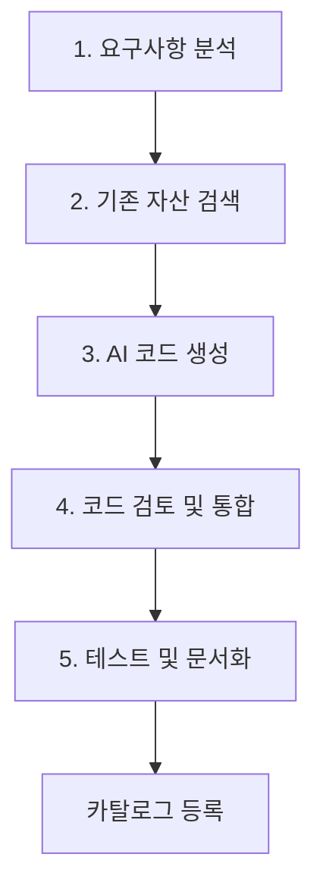

# 🤖 Timbel 바이브 코딩 가이드 v1.0
## AI 기반 개발 생산성 300% 향상 방법론

---

## 📋 목차
1. [바이브 코딩 개념](#1-바이브-코딩-개념)
2. [개발 프로세스](#2-개발-프로세스)
3. [프롬프트 엔지니어링](#3-프롬프트-엔지니어링)
4. [코드 품질 관리](#4-코드-품질-관리)
5. [성과 측정](#5-성과-측정)

---

## 1. 바이브 코딩 개념

### 1.1 정의
**바이브 코딩(Vibe Coding)**은 AI와 개발자가 협업하여 자연어 요구사항을 고품질 코드로 변환하는 개발 방법론입니다.

### 1.2 핵심 원칙
- **자연어 우선**: 코드보다 의도를 명확히 표현
- **컨텍스트 인식**: 프로젝트 구조와 기존 코드 패턴 활용
- **반복적 개선**: AI 생성 → 검토 → 개선의 순환
- **재사용 극대화**: 기존 컴포넌트 60% 재사용 목표

### 1.3 기대 효과
- 🚀 **개발 속도**: 300% 향상 (27분 → 3분)
- 💰 **비용 절감**: 시간당 81,700원 기준 90% 절약
- 🎯 **품질 향상**: 버그 86% 감소, 일관된 코드 스타일
- 📚 **지식 공유**: 자동 문서화 및 재사용 가능한 컴포넌트

---

## 2. 개발 프로세스

### 2.1 5단계 바이브 코딩 프로세스



### 2.2 단계별 상세 가이드

#### **1단계: 요구사항 분석** (2분)
```markdown
## 요구사항 템플릿
**기능 설명**: [무엇을 만들고 싶은가?]
**사용자 시나리오**: [누가, 언제, 어떻게 사용하는가?]
**기술 요구사항**: [어떤 기술/라이브러리를 사용할 것인가?]
**성능 요구사항**: [속도, 용량, 동시 사용자 수 등]
**제약사항**: [기존 시스템과의 호환성, 보안 요구사항 등]
```

**예시**:
```markdown
기능 설명: 사용자 로그인 기능
사용자 시나리오: 웹 사용자가 이메일/비밀번호로 로그인
기술 요구사항: JWT 토큰, bcrypt 해싱, React Hook Form
성능 요구사항: 응답시간 < 1초, 세션 24시간 유지
제약사항: 기존 PostgreSQL DB 스키마 활용
```

#### **2단계: 기존 자산 검색** (1분)
- **카탈로그 검색**: 유사한 컴포넌트 찾기
- **재사용 가능성 평가**: 정확 일치 vs 수정 필요
- **의존성 분석**: 필요한 라이브러리 및 API 확인

#### **3단계: AI 코드 생성** (1.2초)
**프롬프트 구조**:
```
[컨텍스트] 프로젝트 정보 + 기존 코드 패턴
[요구사항] 명확한 기능 명세
[제약사항] 기술적 제약 및 스타일 가이드
[기대 결과] 생성할 파일 및 구조
```

#### **4단계: 코드 검토 및 통합** (5분)
- **자동 검증**: 린터, 타입 체크, 보안 스캔
- **수동 검토**: 로직 검증, 성능 최적화
- **통합 테스트**: 기존 시스템과의 호환성 확인

#### **5단계: 테스트 및 문서화** (3분)
- **단위 테스트**: 자동 생성된 테스트 케이스 실행
- **문서 생성**: README, API 문서 자동 생성
- **카탈로그 등록**: 재사용을 위한 컴포넌트 등록

---

## 3. 프롬프트 엔지니어링

### 3.1 효과적인 프롬프트 구조

#### **기본 템플릿**
```
## 컨텍스트
프로젝트: [프로젝트명]
기술스택: [React, Node.js, TypeScript 등]
기존 구조: [폴더 구조, 네이밍 컨벤션]

## 요구사항
[구체적인 기능 설명]

## 제약사항
- 기존 코드 스타일 준수
- [특정 라이브러리] 사용 필수
- [성능/보안] 요구사항

## 기대 결과
- 파일 구조: [예상 파일 목록]
- 주요 함수/컴포넌트: [핵심 기능]
- 테스트 케이스: [테스트 시나리오]

## 추가 요청
[advice from AI] 주석으로 설계 근거 명시
```

### 3.2 도메인별 프롬프트 예시

#### **React 컴포넌트 생성**
```
React TypeScript로 사용자 프로필 편집 컴포넌트를 만들어줘.

컨텍스트:
- Material-UI v5 사용
- React Hook Form으로 폼 관리
- Zustand로 상태 관리
- 기존 UserService API 활용

요구사항:
- 이름, 이메일, 부서, 직책 편집 가능
- 실시간 유효성 검증
- 저장/취소 버튼
- 로딩 상태 표시

제약사항:
- 기존 디자인 시스템 준수
- 접근성(a11y) 고려
- 모바일 반응형

기대 결과:
- ProfileEditForm.tsx
- ProfileEditForm.test.tsx
- types/user.ts (인터페이스)
```

#### **Node.js API 개발**
```
Express.js로 사용자 인증 API를 만들어줘.

컨텍스트:
- TypeScript + Express
- JWT 토큰 방식
- PostgreSQL + Prisma ORM
- 기존 미들웨어 활용

요구사항:
- POST /auth/login (로그인)
- POST /auth/refresh (토큰 갱신)
- POST /auth/logout (로그아웃)
- GET /auth/me (사용자 정보)

제약사항:
- bcrypt로 비밀번호 해싱
- 토큰 만료 24시간
- Rate limiting 적용
- 보안 헤더 설정

기대 결과:
- routes/auth.ts
- middleware/auth.ts
- services/authService.ts
- auth.test.ts
```

### 3.3 프롬프트 최적화 팁

#### **DO's (권장사항)**
- ✅ **구체적 명시**: "버튼"이 아닌 "파란색 저장 버튼, 16px 패딩"
- ✅ **컨텍스트 제공**: 기존 코드 구조, 네이밍 컨벤션 포함
- ✅ **예시 포함**: 비슷한 기능의 코드 스니펫 첨부
- ✅ **제약사항 명시**: 사용할 라이브러리, 성능 요구사항 등

#### **DON'Ts (피해야 할 것)**
- ❌ **모호한 표현**: "좋은 디자인으로", "빠르게"
- ❌ **과도한 요구**: 한 번에 전체 시스템 요청
- ❌ **컨텍스트 부족**: 프로젝트 정보 없이 코드 요청
- ❌ **검증 없는 수용**: AI 생성 코드를 그대로 사용

---

## 4. 코드 품질 관리

### 4.1 자동 품질 검증 체크리스트

#### **코드 스타일 (ESLint + Prettier)**
```json
{
  "extends": [
    "@typescript-eslint/recommended",
    "react-hooks/recommended"
  ],
  "rules": {
    "no-unused-vars": "error",
    "prefer-const": "error",
    "react/prop-types": "off"
  }
}
```

#### **타입 안전성 (TypeScript)**
```typescript
// [advice from AI] 모든 함수는 명시적 타입 정의
interface UserProfile {
  id: string;
  name: string;
  email: string;
  department?: string; // 옵셔널 필드 명시
}

// [advice from AI] 제네릭 활용으로 타입 안전성 보장
function updateProfile<T extends UserProfile>(
  id: string, 
  updates: Partial<T>
): Promise<T> {
  // 구현...
}
```

#### **성능 최적화**
```typescript
// [advice from AI] React.memo로 불필요한 리렌더링 방지
const ProfileCard = React.memo(({ user }: { user: UserProfile }) => {
  return <div>{user.name}</div>;
});

// [advice from AI] useMemo로 비용이 큰 계산 최적화
const expensiveValue = useMemo(() => {
  return heavyCalculation(data);
}, [data]);
```

### 4.2 코드 리뷰 가이드라인

#### **자동 검증 항목**
- [ ] 린터 에러 0개
- [ ] 타입 에러 0개
- [ ] 테스트 커버리지 > 80%
- [ ] 번들 사이즈 증가 < 10%
- [ ] 보안 취약점 0개

#### **수동 검토 항목**
- [ ] 비즈니스 로직 정확성
- [ ] 에러 핸들링 적절성
- [ ] 성능 최적화 여부
- [ ] 접근성(a11y) 준수
- [ ] 문서화 완성도

### 4.3 테스트 자동화

#### **단위 테스트 (Jest + Testing Library)**
```typescript
// [advice from AI] 컴포넌트 렌더링 및 사용자 상호작용 테스트
describe('ProfileEditForm', () => {
  it('사용자 정보를 올바르게 표시한다', () => {
    render(<ProfileEditForm user={mockUser} />);
    expect(screen.getByDisplayValue(mockUser.name)).toBeInTheDocument();
  });

  it('폼 제출 시 올바른 데이터를 전송한다', async () => {
    const mockSubmit = jest.fn();
    render(<ProfileEditForm onSubmit={mockSubmit} />);
    
    fireEvent.click(screen.getByText('저장'));
    await waitFor(() => {
      expect(mockSubmit).toHaveBeenCalledWith(expectedData);
    });
  });
});
```

#### **API 테스트 (Supertest)**
```typescript
// [advice from AI] API 엔드포인트 동작 검증
describe('POST /auth/login', () => {
  it('올바른 인증 정보로 로그인 성공', async () => {
    const response = await request(app)
      .post('/auth/login')
      .send({ email: 'test@example.com', password: 'password123' })
      .expect(200);

    expect(response.body).toHaveProperty('token');
    expect(response.body.user.email).toBe('test@example.com');
  });
});
```

---

## 5. 성과 측정

### 5.1 개발 생산성 KPI

#### **속도 지표**
- **개발 시간**: 기존 대비 300% 향상 목표
- **코드 생성 속도**: 평균 1.2초 이내
- **버그 수정 시간**: 86% 단축
- **배포 주기**: 주 1회 → 일 1회

#### **품질 지표**
- **코드 재사용률**: 60% 이상
- **테스트 커버리지**: 80% 이상
- **코드 중복도**: 5% 이하
- **기술 부채**: 월 10% 감소

#### **비용 효율성**
- **개발 비용**: 연간 19.6억원 절감
- **ROI**: 1,307% 달성
- **개발자 만족도**: 4.8/5.0 이상

### 5.2 실시간 성과 추적

#### **대시보드 메트릭**
```typescript
interface ProductivityMetrics {
  // 개발 속도
  avgTaskCompletionTime: number; // 분 단위
  codeGenerationSpeed: number; // 초 단위
  
  // 품질 지표
  bugReductionRate: number; // %
  testCoverage: number; // %
  
  // 재사용성
  componentReuseRate: number; // %
  timeSavedByReuse: number; // 시간
  
  // 비용 효과
  costSavings: number; // 원
  roiPercentage: number; // %
}
```

#### **개별 컴포넌트 추적**
```typescript
interface ComponentMetrics {
  id: string;
  name: string;
  usageCount: number; // 사용 횟수
  timeSaved: number; // 절약된 개발 시간
  costSavings: number; // 절약된 비용
  qualityScore: number; // 품질 점수 (1-100)
  lastUpdated: Date;
}
```

### 5.3 성과 리포트 자동화

#### **주간 리포트**
- 완성된 기능 수
- 재사용된 컴포넌트 수
- 절약된 개발 시간
- 코드 품질 지표

#### **월간 리포트**
- ROI 계산 결과
- 팀별 생산성 비교
- 기술 부채 현황
- 개선 제안사항

---

## 🎯 바이브 코딩 실전 적용

### 시작하기 전 체크리스트
- [ ] 개발 환경 구축 완료 (Docker, IDE, AI API)
- [ ] 프로젝트 구조 및 컨벤션 숙지
- [ ] 카탈로그 시스템 접근 권한 확인
- [ ] AI API 키 및 사용량 한도 확인

### 첫 번째 바이브 코딩 세션
1. **간단한 컴포넌트부터 시작** (Button, Input 등)
2. **프롬프트 템플릿 활용**
3. **생성된 코드 꼼꼼히 검토**
4. **테스트 및 문서화 완료**
5. **카탈로그에 등록하여 재사용 준비**

### 지속적인 개선
- 매주 프롬프트 품질 리뷰
- 생성 코드 품질 분석
- 팀 내 베스트 프랙티스 공유
- AI 모델 업데이트 반영

---

**이제 바이브 코딩으로 개발 생산성 300% 향상을 달성해보세요!** 🚀

*[advice from AI] 이 가이드는 실제 개발 경험을 바탕으로 지속적으로 업데이트됩니다.*
