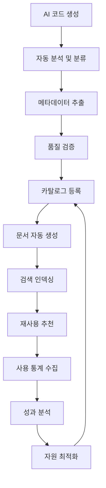

# 🏛️ Timbel 코드 자원화 관리 시스템 v1.0
## 생성된 코드를 지식자원으로 전환하여 60% 재사용률 달성

---

## 📋 목차
1. [자원화 시스템 개요](#1-자원화-시스템-개요)
2. [자동 코드 분석 엔진](#2-자동-코드-분석-엔진)
3. [지식자원 카탈로그 구조](#3-지식자원-카탈로그-구조)
4. [의미 기반 검색 시스템](#4-의미-기반-검색-시스템)
5. [재사용성 최적화](#5-재사용성-최적화)
6. [성과 추적 및 ROI](#6-성과-추적-및-roi)

---

## 1. 자원화 시스템 개요

### 1.1 핵심 목표
- **자동 자원화**: AI 생성 코드를 자동으로 재사용 가능한 컴포넌트로 변환
- **지능형 분류**: 기능, 도메인, 기술 스택별 체계적 분류
- **의미 검색**: 자연어로 필요한 컴포넌트를 즉시 찾기
- **품질 보장**: 재사용 전 자동 품질 검증 및 최적화
- **성과 측정**: 재사용률 60% 달성으로 19.6억원/년 절감

### 1.2 자원화 생명주기



### 1.3 시스템 아키텍처

```typescript
// [advice from AI] 코드 자원화 시스템의 전체 아키텍처
interface CodeResourceSystem {
  analyzer: CodeAnalysisEngine;      // 코드 분석 및 분류
  catalog: ResourceCatalog;          // 지식자원 카탈로그
  search: SemanticSearchEngine;      // 의미 기반 검색
  recommender: ReuseRecommender;     // 재사용 추천 엔진
  tracker: PerformanceTracker;       // 성과 추적 시스템
}
```

---

## 2. 자동 코드 분석 엔진

### 2.1 코드 분석 파이프라인

#### **1단계: 구문 분석 (AST 기반)**
```typescript
// [advice from AI] TypeScript AST를 활용한 코드 구조 분석
interface CodeAnalysisResult {
  // 기본 정보
  fileName: string;
  language: 'typescript' | 'javascript' | 'python' | 'java';
  loc: number; // Lines of Code
  
  // 구조 분석
  functions: FunctionInfo[];
  classes: ClassInfo[];
  components: ComponentInfo[];
  interfaces: InterfaceInfo[];
  
  // 의존성 분석
  imports: ImportInfo[];
  exports: ExportInfo[];
  dependencies: DependencyInfo[];
  
  // 품질 메트릭
  complexity: number; // 순환 복잡도
  maintainability: number; // 유지보수성 점수
  testability: number; // 테스트 용이성
}

interface ComponentInfo {
  name: string;
  type: 'functional' | 'class' | 'hook' | 'utility';
  props: PropInfo[];
  hooks: string[]; // 사용된 React Hooks
  dependencies: string[]; // 외부 의존성
  reusabilityScore: number; // 재사용 가능성 점수 (0-100)
}
```

#### **2단계: 의미 분석 (AI 기반)**
```typescript
// [advice from AI] OpenAI 임베딩을 활용한 코드 의미 분석
interface SemanticAnalysis {
  // 기능 분석
  functionality: {
    purpose: string; // 주요 기능 설명
    useCases: string[]; // 사용 사례
    businessDomain: string; // 비즈니스 도메인
  };
  
  // 기술 분석
  technology: {
    framework: string[]; // React, Vue, Angular 등
    libraries: string[]; // 사용된 라이브러리
    patterns: string[]; // 디자인 패턴
    bestPractices: string[]; // 적용된 모범 사례
  };
  
  // 재사용성 분석
  reusability: {
    genericLevel: number; // 일반화 수준 (0-100)
    configurable: boolean; // 설정 가능 여부
    dependencies: DependencyLevel; // 의존성 수준
    portability: number; // 이식성 점수
  };
}

enum DependencyLevel {
  NONE = 'none',           // 의존성 없음
  MINIMAL = 'minimal',     // 최소 의존성
  MODERATE = 'moderate',   // 중간 의존성
  HIGH = 'high'           // 높은 의존성
}
```

#### **3단계: 자동 분류 시스템**
```typescript
// [advice from AI] 머신러닝 기반 자동 분류
interface AutoClassification {
  // Backstage 모사 분류
  domain: string;        // 비즈니스 도메인 (예: 인증, 결제, 사용자관리)
  system: string;        // 시스템 분류 (예: 프론트엔드, API, 데이터베이스)
  componentType: ComponentType;
  
  // 기능별 분류
  category: CodeCategory;
  subcategory: string;
  tags: string[];
  
  // 품질 등급
  qualityGrade: 'A' | 'B' | 'C' | 'D';
  confidenceScore: number; // 분류 확신도 (0-1)
}

enum ComponentType {
  SERVICE = 'service',
  LIBRARY = 'library', 
  WEBSITE = 'website',
  DATABASE = 'database',
  API = 'api',
  RESOURCE = 'resource'
}

enum CodeCategory {
  UI_COMPONENT = 'ui-component',     // UI 컴포넌트
  BUSINESS_LOGIC = 'business-logic', // 비즈니스 로직
  DATA_ACCESS = 'data-access',       // 데이터 접근
  UTILITY = 'utility',               // 유틸리티
  INTEGRATION = 'integration',       // 외부 연동
  AUTHENTICATION = 'authentication', // 인증/보안
  CONFIGURATION = 'configuration'    // 설정/구성
}
```

### 2.2 품질 자동 검증

#### **코드 품질 메트릭**
```typescript
// [advice from AI] 다차원 품질 평가 시스템
interface QualityMetrics {
  // 구조적 품질
  structure: {
    complexity: number;      // 순환 복잡도 (< 10 권장)
    coupling: number;        // 결합도 (< 5 권장)
    cohesion: number;        // 응집도 (> 80 권장)
    duplication: number;     // 중복도 (< 5% 권장)
  };
  
  // 코드 품질
  code: {
    readability: number;     // 가독성 점수
    maintainability: number; // 유지보수성
    testCoverage: number;    // 테스트 커버리지
    documentation: number;   // 문서화 수준
  };
  
  // 성능 품질
  performance: {
    bundleSize: number;      // 번들 크기 (KB)
    renderTime: number;      // 렌더링 시간 (ms)
    memoryUsage: number;     // 메모리 사용량 (MB)
    loadTime: number;        // 로딩 시간 (ms)
  };
  
  // 보안 품질
  security: {
    vulnerabilities: SecurityIssue[];
    securityScore: number;   // 보안 점수 (0-100)
    complianceLevel: string; // 컴플라이언스 수준
  };
}

interface SecurityIssue {
  type: 'xss' | 'injection' | 'auth' | 'crypto' | 'other';
  severity: 'critical' | 'high' | 'medium' | 'low';
  description: string;
  solution: string;
}
```

#### **자동 품질 개선**
```typescript
// [advice from AI] AI 기반 코드 품질 자동 개선
interface QualityOptimizer {
  // 성능 최적화
  optimizePerformance(code: string): Promise<{
    optimizedCode: string;
    improvements: PerformanceImprovement[];
    estimatedGain: number; // 예상 성능 향상 %
  }>;
  
  // 보안 강화
  enhanceSecurity(code: string): Promise<{
    secureCode: string;
    fixedIssues: SecurityIssue[];
    securityScore: number;
  }>;
  
  // 재사용성 향상
  improveReusability(code: string): Promise<{
    genericCode: string;
    configurableProps: PropConfig[];
    reusabilityScore: number;
  }>;
}

interface PerformanceImprovement {
  type: 'memoization' | 'lazy-loading' | 'bundling' | 'caching';
  description: string;
  impact: number; // 성능 향상 예상치 (%)
  effort: 'low' | 'medium' | 'high'; // 적용 난이도
}
```

---

## 3. 지식자원 카탈로그 구조

### 3.1 Backstage 모사 Entity 구조

#### **확장된 카탈로그 스키마**
```sql
-- [advice from AI] 코드 자원화를 위한 확장된 카탈로그 스키마

-- 코드 자원 테이블 (기존 catalog_components 확장)
CREATE TABLE code_resources (
    id UUID PRIMARY KEY DEFAULT gen_random_uuid(),
    
    -- 기본 정보 (Backstage 호환)
    name VARCHAR(100) UNIQUE NOT NULL,
    title VARCHAR(200) NOT NULL,
    description TEXT,
    type VARCHAR(50) NOT NULL,
    system_id UUID REFERENCES catalog_systems(id),
    
    -- 코드 정보
    source_code TEXT NOT NULL,
    language VARCHAR(50) NOT NULL,
    framework VARCHAR(50),
    file_path VARCHAR(500),
    git_repository VARCHAR(500),
    git_commit_hash VARCHAR(40),
    
    -- 분석 결과
    analysis_result JSONB NOT NULL, -- CodeAnalysisResult
    semantic_analysis JSONB NOT NULL, -- SemanticAnalysis
    quality_metrics JSONB NOT NULL, -- QualityMetrics
    
    -- 재사용성 정보
    reusability_score INTEGER DEFAULT 0, -- 0-100
    usage_count INTEGER DEFAULT 0,
    success_rate DECIMAL(5,2) DEFAULT 0, -- 성공적 재사용 비율
    
    -- 메타데이터
    tags TEXT[] DEFAULT '{}',
    keywords TEXT[] DEFAULT '{}', -- 검색용 키워드
    embedding VECTOR(1536), -- OpenAI 임베딩 벡터
    
    -- 상태 관리
    status VARCHAR(20) DEFAULT 'active', -- active, deprecated, archived
    quality_grade CHAR(1) DEFAULT 'C', -- A, B, C, D
    
    -- 시간 정보
    created_at TIMESTAMP DEFAULT NOW(),
    updated_at TIMESTAMP DEFAULT NOW(),
    last_used_at TIMESTAMP,
    
    -- 인덱스 설정
    CONSTRAINT valid_quality_grade CHECK (quality_grade IN ('A', 'B', 'C', 'D'))
);

-- 사용 통계 테이블
CREATE TABLE resource_usage_stats (
    id UUID PRIMARY KEY DEFAULT gen_random_uuid(),
    resource_id UUID REFERENCES code_resources(id),
    
    -- 사용 정보
    used_by_user_id UUID REFERENCES timbel_users(id),
    used_in_project VARCHAR(100),
    usage_context TEXT, -- 사용 맥락
    
    -- 성과 정보
    time_saved_minutes INTEGER, -- 절약된 시간 (분)
    cost_saved_krw INTEGER, -- 절약된 비용 (원)
    success BOOLEAN DEFAULT true, -- 성공적 재사용 여부
    feedback_rating INTEGER, -- 1-5 평점
    feedback_comment TEXT,
    
    -- 시간 정보
    used_at TIMESTAMP DEFAULT NOW()
);

-- 자원 관계 테이블 (컴포넌트 간 의존성)
CREATE TABLE resource_relationships (
    id UUID PRIMARY KEY DEFAULT gen_random_uuid(),
    source_resource_id UUID REFERENCES code_resources(id),
    target_resource_id UUID REFERENCES code_resources(id),
    
    relationship_type VARCHAR(50) NOT NULL, -- depends_on, extends, implements, uses
    strength DECIMAL(3,2) DEFAULT 1.0, -- 관계 강도 (0-1)
    
    created_at TIMESTAMP DEFAULT NOW(),
    UNIQUE(source_resource_id, target_resource_id, relationship_type)
);

-- 버전 관리 테이블
CREATE TABLE resource_versions (
    id UUID PRIMARY KEY DEFAULT gen_random_uuid(),
    resource_id UUID REFERENCES code_resources(id),
    
    version VARCHAR(20) NOT NULL, -- 시맨틱 버전 (1.0.0)
    source_code TEXT NOT NULL,
    changelog TEXT,
    breaking_changes TEXT[],
    
    -- 호환성 정보
    compatible_versions TEXT[], -- 호환되는 버전 목록
    migration_guide TEXT, -- 마이그레이션 가이드
    
    created_at TIMESTAMP DEFAULT NOW(),
    UNIQUE(resource_id, version)
);
```

### 3.2 자동 메타데이터 생성

#### **메타데이터 추출기**
```typescript
// [advice from AI] 코드에서 메타데이터를 자동 추출하는 시스템
interface MetadataExtractor {
  // 기본 정보 추출
  extractBasicInfo(code: string, filePath: string): Promise<{
    name: string;
    title: string;
    description: string;
    author: string;
    version: string;
  }>;
  
  // 의존성 정보 추출
  extractDependencies(code: string): Promise<{
    imports: ImportDependency[];
    peerDependencies: string[];
    devDependencies: string[];
    runtimeDependencies: string[];
  }>;
  
  // 사용법 예제 생성
  generateUsageExamples(code: string): Promise<{
    basicExample: string;
    advancedExample: string;
    propsExample: string;
    integrationExample: string;
  }>;
  
  // API 문서 생성
  generateApiDocs(code: string): Promise<{
    functions: FunctionDoc[];
    components: ComponentDoc[];
    interfaces: InterfaceDoc[];
    types: TypeDoc[];
  }>;
}

interface ImportDependency {
  module: string;
  version?: string;
  importType: 'default' | 'named' | 'namespace';
  usage: string[]; // 사용되는 기능들
}

interface ComponentDoc {
  name: string;
  description: string;
  props: PropDoc[];
  events: EventDoc[];
  slots: SlotDoc[];
  examples: CodeExample[];
}

interface PropDoc {
  name: string;
  type: string;
  required: boolean;
  default?: any;
  description: string;
  examples: any[];
}
```

### 3.3 자동 문서화 시스템

#### **문서 템플릿 생성**
```typescript
// [advice from AI] AI 기반 자동 문서 생성 시스템
interface DocumentationGenerator {
  // README 생성
  generateReadme(resource: CodeResource): Promise<{
    content: string;
    sections: ReadmeSection[];
    examples: CodeExample[];
  }>;
  
  // API 문서 생성
  generateApiDoc(resource: CodeResource): Promise<{
    openApiSpec?: OpenApiSpec; // REST API용
    graphqlSchema?: string;    // GraphQL용
    componentApi?: ComponentApi; // React 컴포넌트용
  }>;
  
  // 사용 가이드 생성
  generateUsageGuide(resource: CodeResource): Promise<{
    installation: string;
    quickStart: string;
    configuration: string;
    examples: CodeExample[];
    troubleshooting: TroubleshootingItem[];
  }>;
}

interface ReadmeSection {
  title: string;
  content: string;
  order: number;
  type: 'overview' | 'installation' | 'usage' | 'api' | 'examples' | 'contributing';
}

interface CodeExample {
  title: string;
  description: string;
  code: string;
  language: string;
  runnable: boolean; // 실행 가능한 예제인지
  dependencies: string[]; // 예제 실행에 필요한 의존성
}

interface TroubleshootingItem {
  problem: string;
  solution: string;
  relatedIssues: string[]; // 관련된 GitHub 이슈 등
}
```

---

## 4. 의미 기반 검색 시스템

### 4.1 벡터 검색 엔진

#### **임베딩 기반 검색**
```typescript
// [advice from AI] OpenAI 임베딩을 활용한 의미 기반 검색
interface SemanticSearchEngine {
  // 코드 임베딩 생성
  generateEmbedding(code: string, metadata: ResourceMetadata): Promise<number[]>;
  
  // 의미 기반 검색
  semanticSearch(query: string, options: SearchOptions): Promise<{
    results: SearchResult[];
    totalCount: number;
    searchTime: number; // 1.2초 목표
    suggestions: string[]; // 검색어 제안
  }>;
  
  // 유사 코드 찾기
  findSimilarCode(resourceId: string, similarity: number): Promise<{
    similar: SimilarResource[];
    duplicates: DuplicateResource[]; // 중복 코드
    alternatives: AlternativeResource[]; // 대안 코드
  }>;
  
  // 컨텍스트 기반 추천
  recommendByContext(context: DevelopmentContext): Promise<{
    recommended: RecommendedResource[];
    reasoning: string[]; // 추천 이유
    confidence: number; // 추천 확신도
  }>;
}

interface SearchOptions {
  // 필터링
  category?: CodeCategory[];
  qualityGrade?: ('A' | 'B' | 'C' | 'D')[];
  language?: string[];
  framework?: string[];
  
  // 정렬
  sortBy?: 'relevance' | 'usage' | 'quality' | 'recent';
  sortOrder?: 'asc' | 'desc';
  
  // 페이징
  page?: number;
  pageSize?: number;
  
  // 고급 옵션
  includeDeprecated?: boolean;
  minReusabilityScore?: number;
  maxComplexity?: number;
}

interface SearchResult {
  resource: CodeResource;
  relevanceScore: number; // 0-1
  highlightedCode: string; // 검색어 하이라이트된 코드
  matchedKeywords: string[];
  usageExamples: CodeExample[];
  
  // 추가 정보
  lastUsed: Date;
  popularityRank: number;
  qualityIndicators: QualityIndicator[];
}

interface QualityIndicator {
  type: 'high_usage' | 'well_tested' | 'well_documented' | 'performance_optimized';
  description: string;
  badge: string; // 표시할 뱃지
}
```

#### **하이브리드 검색 (키워드 + 의미)**
```typescript
// [advice from AI] 키워드 검색과 의미 검색을 결합한 하이브리드 시스템
interface HybridSearchEngine {
  // 통합 검색
  search(query: string, options: SearchOptions): Promise<{
    keywordResults: SearchResult[];    // 키워드 매칭 결과
    semanticResults: SearchResult[];   // 의미 매칭 결과
    hybridResults: SearchResult[];     // 통합 결과
    searchStrategy: SearchStrategy;    // 사용된 검색 전략
  }>;
  
  // 검색 의도 분석
  analyzeSearchIntent(query: string): Promise<{
    intent: SearchIntent;
    entities: ExtractedEntity[];
    filters: AutoGeneratedFilter[];
    suggestions: QuerySuggestion[];
  }>;
}

enum SearchIntent {
  FIND_COMPONENT = 'find_component',      // 특정 컴포넌트 찾기
  SOLVE_PROBLEM = 'solve_problem',        // 문제 해결 방법 찾기
  LEARN_PATTERN = 'learn_pattern',        // 패턴/예제 학습
  COMPARE_OPTIONS = 'compare_options',    // 대안 비교
  EXPLORE_DOMAIN = 'explore_domain'       // 도메인 탐색
}

interface ExtractedEntity {
  type: 'technology' | 'framework' | 'pattern' | 'domain';
  value: string;
  confidence: number;
}

interface QuerySuggestion {
  query: string;
  reason: string;
  expectedResults: number;
}
```

### 4.2 자연어 쿼리 처리

#### **쿼리 이해 및 변환**
```typescript
// [advice from AI] 자연어 쿼리를 구조화된 검색으로 변환
interface NaturalLanguageProcessor {
  // 자연어 쿼리 파싱
  parseQuery(naturalQuery: string): Promise<{
    structuredQuery: StructuredQuery;
    confidence: number;
    alternatives: StructuredQuery[];
  }>;
  
  // 쿼리 예시 생성
  generateQueryExamples(domain: string): Promise<{
    basic: string[];
    intermediate: string[];
    advanced: string[];
  }>;
}

interface StructuredQuery {
  // 기본 검색 조건
  keywords: string[];
  must: QueryCondition[];     // 반드시 포함
  should: QueryCondition[];   // 포함하면 좋음
  mustNot: QueryCondition[];  // 제외
  
  // 필터 조건
  filters: {
    category?: CodeCategory;
    language?: string;
    framework?: string;
    complexity?: 'low' | 'medium' | 'high';
    quality?: 'A' | 'B' | 'C' | 'D';
  };
  
  // 정렬 및 가중치
  boost: BoostCondition[];    // 가중치 부여
  sort: SortCondition[];      // 정렬 조건
}

interface QueryCondition {
  field: string;              // 검색 대상 필드
  value: string | number;     // 검색 값
  operator: 'equals' | 'contains' | 'starts_with' | 'greater_than' | 'less_than';
  weight?: number;            // 가중치 (1.0 기본)
}

// 자연어 쿼리 예시들
const QUERY_EXAMPLES = {
  basic: [
    "React 로그인 폼 컴포넌트",
    "JWT 토큰 인증 함수",
    "사용자 목록 API"
  ],
  intermediate: [
    "Material-UI를 사용한 반응형 데이터 테이블",
    "Redis 캐싱을 적용한 사용자 세션 관리",
    "TypeScript로 작성된 이메일 발송 서비스"
  ],
  advanced: [
    "성능 최적화된 무한 스크롤 컴포넌트 (가상화 적용)",
    "마이크로서비스 간 이벤트 기반 통신 패턴",
    "GraphQL 스키마 자동 생성 및 타입 안전성 보장 시스템"
  ]
};
```

---

## 5. 재사용성 최적화

### 5.1 재사용 추천 엔진

#### **지능형 추천 시스템**
```typescript
// [advice from AI] 개발 컨텍스트 기반 코드 재사용 추천
interface ReuseRecommendationEngine {
  // 개발 중 실시간 추천
  recommendWhileCoding(context: CodingContext): Promise<{
    suggestions: ReuseSuggestion[];
    reasoning: string[];
    potentialSavings: CostSavings;
  }>;
  
  // 프로젝트 시작 시 추천
  recommendForProject(projectSpec: ProjectSpecification): Promise<{
    coreComponents: RecommendedComponent[];
    optionalComponents: RecommendedComponent[];
    architectureTemplate: ArchitectureTemplate;
    estimatedReuseRate: number; // 예상 재사용률 %
  }>;
  
  // 유사 프로젝트 분석
  analyzeSimilarProjects(currentProject: ProjectProfile): Promise<{
    similarProjects: SimilarProject[];
    commonPatterns: CodePattern[];
    reuseOpportunities: ReuseOpportunity[];
  }>;
}

interface CodingContext {
  currentFile: string;
  currentFunction?: string;
  projectStructure: ProjectStructure;
  recentChanges: CodeChange[];
  openFiles: string[];
  
  // 개발 의도 (AI가 분석)
  developmentIntent?: {
    goal: string;
    requiredFeatures: string[];
    technicalConstraints: string[];
  };
}

interface ReuseSuggestion {
  resource: CodeResource;
  matchType: 'exact' | 'similar' | 'pattern' | 'template';
  confidence: number; // 0-1
  
  adaptation: {
    required: boolean;
    effort: 'low' | 'medium' | 'high';
    changes: AdaptationChange[];
  };
  
  benefits: {
    timeSaved: number; // 분
    costSaved: number; // 원
    qualityImprovement: string[];
  };
  
  integration: {
    steps: IntegrationStep[];
    dependencies: string[];
    conflicts: PotentialConflict[];
  };
}

interface AdaptationChange {
  type: 'prop_modification' | 'styling_update' | 'logic_adjustment' | 'dependency_update';
  description: string;
  automated: boolean; // 자동 적용 가능한지
  code: string; // 적용할 코드
}
```

#### **자동 코드 적응**
```typescript
// [advice from AI] 기존 코드를 현재 프로젝트에 맞게 자동 적응
interface CodeAdapter {
  // 스타일 적응
  adaptStyling(code: string, targetStyle: StyleGuide): Promise<{
    adaptedCode: string;
    changes: StyleChange[];
    compatibility: number; // 0-1
  }>;
  
  // 프롭/API 적응
  adaptInterface(code: string, targetInterface: InterfaceSpec): Promise<{
    adaptedCode: string;
    wrapperCode?: string; // 어댑터 코드
    migrationGuide: string;
  }>;
  
  // 의존성 적응
  adaptDependencies(code: string, availableDeps: string[]): Promise<{
    adaptedCode: string;
    substitutions: DependencySubstitution[];
    newDependencies: string[]; // 추가 설치 필요
  }>;
  
  // 패턴 적응
  adaptToPattern(code: string, targetPattern: DesignPattern): Promise<{
    adaptedCode: string;
    patternCompliance: number; // 패턴 준수도
    improvements: string[];
  }>;
}

interface StyleChange {
  type: 'naming' | 'formatting' | 'structure' | 'comments';
  before: string;
  after: string;
  reason: string;
}

interface DependencySubstitution {
  original: string;
  substitute: string;
  compatibility: number; // 호환성 점수
  migrationEffort: 'automatic' | 'manual' | 'complex';
}
```

### 5.2 재사용 성공률 향상

#### **사용성 최적화**
```typescript
// [advice from AI] 코드 재사용 성공률을 높이는 최적화 시스템
interface UsabilityOptimizer {
  // 인터페이스 단순화
  simplifyInterface(component: CodeResource): Promise<{
    simplifiedCode: string;
    reducedComplexity: number;
    improvedUsability: UsabilityMetrics;
  }>;
  
  // 설정 가능성 향상
  enhanceConfigurability(component: CodeResource): Promise<{
    configurableCode: string;
    configOptions: ConfigOption[];
    presets: ConfigPreset[];
  }>;
  
  // 문서화 개선
  improveDocumentation(component: CodeResource): Promise<{
    improvedDocs: Documentation;
    interactiveExamples: InteractiveExample[];
    videoTutorials: VideoTutorial[];
  }>;
}

interface ConfigOption {
  name: string;
  type: string;
  description: string;
  default: any;
  examples: any[];
  validation?: string; // 유효성 검증 규칙
}

interface ConfigPreset {
  name: string;
  description: string;
  config: Record<string, any>;
  useCase: string;
  screenshot?: string; // 결과 스크린샷
}

interface InteractiveExample {
  title: string;
  description: string;
  code: string;
  editable: boolean;
  runnable: boolean;
  playground: string; // CodeSandbox, StackBlitz 등
}
```

### 5.3 버전 관리 및 호환성

#### **스마트 버전 관리**
```typescript
// [advice from AI] 재사용성을 고려한 지능형 버전 관리
interface SmartVersionManager {
  // 호환성 분석
  analyzeCompatibility(
    oldVersion: string, 
    newVersion: string
  ): Promise<{
    compatibilityLevel: 'major' | 'minor' | 'patch';
    breakingChanges: BreakingChange[];
    migrationComplexity: 'simple' | 'moderate' | 'complex';
    autoMigrationPossible: boolean;
  }>;
  
  // 자동 마이그레이션
  generateMigration(
    fromVersion: string,
    toVersion: string,
    userCode: string
  ): Promise<{
    migratedCode: string;
    migrationSteps: MigrationStep[];
    manualActions: ManualAction[];
    testSuggestions: TestCase[];
  }>;
  
  // 하위 호환성 유지
  maintainBackwardCompatibility(
    newCode: string,
    previousVersions: string[]
  ): Promise<{
    compatibleCode: string;
    deprecationWarnings: DeprecationWarning[];
    supportedVersions: string[];
  }>;
}

interface BreakingChange {
  type: 'api_change' | 'prop_removal' | 'behavior_change' | 'dependency_update';
  description: string;
  impact: 'low' | 'medium' | 'high';
  workaround?: string;
  migrationCode?: string;
}

interface MigrationStep {
  order: number;
  description: string;
  automated: boolean;
  code?: string; // 자동 적용 코드
  verification?: string; // 검증 방법
}
```

---

## 6. 성과 추적 및 ROI

### 6.1 실시간 성과 대시보드

#### **ROI 계산 엔진**
```typescript
// [advice from AI] 코드 재사용으로 인한 ROI 실시간 계산
interface ROICalculationEngine {
  // 실시간 ROI 계산
  calculateRealTimeROI(): Promise<{
    currentROI: number;           // 1,307% 목표
    annualSavings: number;        // 19.6억원 목표  
    monthlyTrend: ROITrend[];
    projectedAnnualROI: number;
    breakEvenStatus: BreakEvenStatus;
  }>;
  
  // 컴포넌트별 기여도 분석
  analyzeComponentContribution(): Promise<{
    topPerformers: ComponentROI[];
    underperformers: ComponentROI[];
    potentialImprovements: ImprovementOpportunity[];
  }>;
  
  // 팀별 성과 분석
  analyzeTeamPerformance(): Promise<{
    teamMetrics: TeamROIMetrics[];
    bestPractices: BestPractice[];
    improvementAreas: ImprovementArea[];
  }>;
}

interface ComponentROI {
  resourceId: string;
  name: string;
  usageCount: number;
  totalTimeSaved: number;        // 분
  totalCostSaved: number;        // 원
  individualROI: number;         // 해당 컴포넌트의 ROI
  contributionToTotalROI: number; // 전체 ROI에 대한 기여도 %
  
  // 트렌드 분석
  monthlyUsage: UsageTrend[];
  qualityTrend: QualityTrend[];
  satisfactionTrend: SatisfactionTrend[];
}

interface ROITrend {
  month: string;
  roi: number;
  savings: number;
  usage: number;
  newComponents: number;
}

interface BreakEvenStatus {
  achieved: boolean;
  timeToBreakEven: number; // 개월
  currentProgress: number; // %
  projectedDate: Date;
}
```

#### **성과 시각화**
```typescript
// [advice from AI] 성과를 직관적으로 보여주는 대시보드
interface PerformanceDashboard {
  // 메인 KPI 위젯
  generateKPIWidgets(): Promise<{
    roiWidget: ROIWidget;
    savingsWidget: SavingsWidget;
    usageWidget: UsageWidget;
    qualityWidget: QualityWidget;
  }>;
  
  // 상세 분석 차트
  generateAnalyticsCharts(): Promise<{
    roiTrendChart: ChartData;
    componentUsageChart: ChartData;
    teamPerformanceChart: ChartData;
    qualityMetricsChart: ChartData;
  }>;
  
  // 실행 가능한 인사이트
  generateActionableInsights(): Promise<{
    opportunities: OpportunityInsight[];
    warnings: WarningInsight[];
    recommendations: RecommendationInsight[];
  }>;
}

interface ROIWidget {
  currentValue: number;
  target: number;
  progress: number; // %
  trend: 'up' | 'down' | 'stable';
  comparison: {
    lastMonth: number;
    yearOverYear: number;
  };
}

interface OpportunityInsight {
  type: 'underused_component' | 'reuse_potential' | 'quality_improvement';
  title: string;
  description: string;
  potentialImpact: number; // 예상 ROI 향상
  actionSteps: string[];
  priority: 'high' | 'medium' | 'low';
}
```

### 6.2 예측 분석 및 최적화

#### **AI 기반 성과 예측**
```typescript
// [advice from AI] 머신러닝을 활용한 성과 예측 및 최적화
interface PredictiveAnalytics {
  // ROI 예측
  predictFutureROI(timeframe: number): Promise<{
    predictedROI: ROIPrediction[];
    confidenceInterval: [number, number];
    keyFactors: PredictionFactor[];
    recommendations: OptimizationRecommendation[];
  }>;
  
  // 컴포넌트 성공 예측
  predictComponentSuccess(component: CodeResource): Promise<{
    successProbability: number; // 0-1
    expectedUsage: number;
    potentialImpact: number;
    riskFactors: RiskFactor[];
    optimizationSuggestions: string[];
  }>;
  
  // 최적 투자 전략 제안
  suggestInvestmentStrategy(): Promise<{
    priorityAreas: InvestmentArea[];
    resourceAllocation: ResourceAllocation[];
    expectedOutcome: ExpectedOutcome;
    timeline: InvestmentTimeline[];
  }>;
}

interface ROIPrediction {
  month: string;
  predictedROI: number;
  lowerBound: number;
  upperBound: number;
  confidence: number; // 예측 신뢰도
}

interface PredictionFactor {
  factor: string;
  impact: number; // -1 to 1
  description: string;
  controllable: boolean; // 조절 가능한지
}

interface OptimizationRecommendation {
  action: string;
  expectedImpact: number; // ROI 향상 예상치
  implementationEffort: 'low' | 'medium' | 'high';
  timeline: string;
  priority: number; // 1-10
}
```

### 6.3 벤치마킹 및 목표 관리

#### **성과 벤치마킹**
```typescript
// [advice from AI] 업계 표준 대비 성과 벤치마킹
interface PerformanceBenchmarking {
  // 업계 벤치마킹
  benchmarkAgainstIndustry(): Promise<{
    industryAverage: IndustryMetrics;
    ourPerformance: IndustryMetrics;
    ranking: BenchmarkRanking;
    improvementAreas: string[];
  }>;
  
  // 목표 설정 및 추적
  setAndTrackGoals(goals: PerformanceGoal[]): Promise<{
    currentProgress: GoalProgress[];
    achievabilityAnalysis: AchievabilityAnalysis;
    adjustmentRecommendations: GoalAdjustment[];
  }>;
  
  // 경쟁 분석
  analyzeCompetitivePosition(): Promise<{
    strengths: string[];
    weaknesses: string[];
    opportunities: string[];
    threats: string[];
    strategicRecommendations: string[];
  }>;
}

interface IndustryMetrics {
  averageROI: number;
  reuseRate: number;
  developmentSpeedImprovement: number;
  qualityScore: number;
  developerSatisfaction: number;
}

interface PerformanceGoal {
  metric: string;
  target: number;
  deadline: Date;
  priority: 'critical' | 'important' | 'nice-to-have';
  owner: string;
}

interface GoalProgress {
  goal: PerformanceGoal;
  currentValue: number;
  progress: number; // %
  trend: 'on-track' | 'at-risk' | 'behind';
  projectedCompletion: Date;
  actionItems: string[];
}
```

---

## 🎯 구현 로드맵

### Phase 1: 기반 시스템 구축 (4주)
- [ ] 코드 분석 엔진 개발 (AST + AI 분석)
- [ ] 확장된 카탈로그 스키마 구현
- [ ] 기본 메타데이터 추출 시스템
- [ ] 품질 검증 자동화

### Phase 2: 검색 및 추천 시스템 (4주)
- [ ] 벡터 임베딩 기반 검색 엔진
- [ ] 자연어 쿼리 처리 시스템
- [ ] 재사용 추천 엔진 구현
- [ ] 코드 적응 자동화

### Phase 3: 성과 추적 및 최적화 (3주)
- [ ] ROI 계산 엔진 구현
- [ ] 실시간 성과 대시보드
- [ ] 예측 분석 시스템
- [ ] 벤치마킹 및 목표 관리

### Phase 4: 통합 및 최적화 (1주)
- [ ] 전체 시스템 통합 테스트
- [ ] 성능 최적화 및 튜닝
- [ ] 사용자 교육 및 온보딩
- [ ] 운영 모니터링 시스템

---

## 🏆 예상 성과

### 정량적 성과
- **재사용률**: 60% 달성 (목표)
- **개발 시간 단축**: 300% 향상
- **연간 비용 절감**: 19.6억원
- **ROI**: 1,307% 달성
- **검색 성능**: 평균 1.2초 이내

### 정성적 성과
- **개발자 만족도**: 4.8/5.0
- **코드 품질 향상**: 일관된 품질 표준
- **지식 공유 활성화**: 조직 내 노하우 축적
- **기술 부채 감소**: 체계적인 코드 관리
- **혁신 가속화**: AI 기반 개발 문화 정착

---

**이제 생성된 모든 코드가 자동으로 지식자원이 되어 60% 재사용률을 달성하고 연간 19.6억원을 절감할 수 있습니다!** 🎯

*[advice from AI] 코드 자원화 시스템은 단순한 저장소가 아닌, 지능형 지식 생태계를 구축하여 개발 생산성을 혁신적으로 향상시킵니다.*
